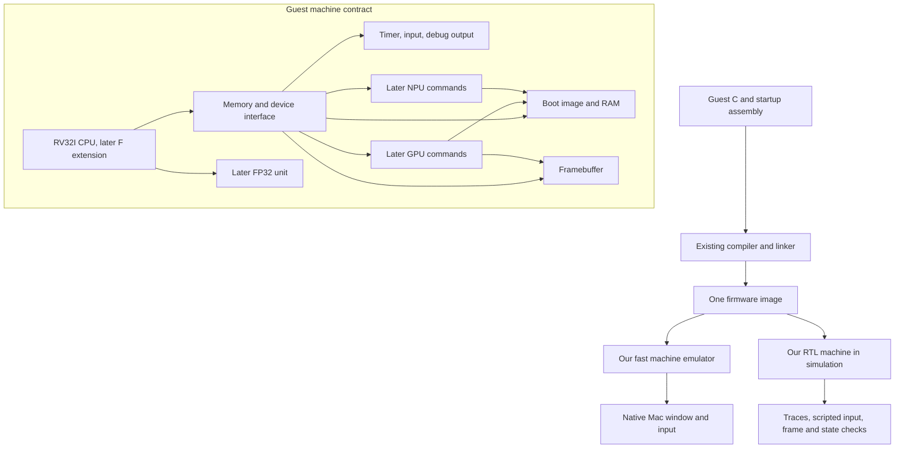

# Our computer: detailed roadmap

Planning baseline: 2026-09-19. The [interview](full-stack-plan.md) records the twelve initial user decisions and the accepted floating-point follow-up. The destination and ordering are selected; the technical defaults below are proposals to make the next work concrete, not implemented features. No implementation was started during this planning session.

## Two finish lines

**First complete computer:** from a fresh checkout and documented prerequisites, build one guest firmware image and launch our emulator in a native Mac window. Our RV32I CPU model executes startup code, initializes our runtime, displays a menu, and runs Pong or Tetris. Tetris supports movement, rotation, falling pieces, line clearing, scoring, game over, and restart. Input, drawing, timing, and game rules run through our guest software and documented machine interfaces. A host debugger or console is useful but is not the guest OS.

The same firmware image runs on the RTL machine. Interactive play uses the fast emulator; bounded, scripted RTL runs verify boot, input, timer behavior, and selected frames/state checkpoints. We do not require full-game RTL simulation at interactive speed. Completion requires both an actual playable session and reproducible automated checks, not only a screenshot.

**Advanced integrated SoC:** the CPU includes verified FP32/F-extension support and runs guest drivers that command the GPU and NPU through defined device registers and shared-memory buffers. The menu can launch a hardware-accelerated 2D demo, a rotating shaded 3D object with a programmable stage, and a digit-drawing interface that displays an NPU inference result. CPU/software reference paths establish correctness. Integration tests verify transfers, completion, errors, reset, and memory ownership. No accelerator is called finished merely because its isolated arithmetic kernel passes.

One scripted integrated scenario exercises both accelerators from the same firmware build. Concurrent execution is a later optimization; sequential CPU ownership is sufficient initially. The host presents the guest framebuffer and forwards keyboard/pointer events; it does not implement the guest game rules, renderer, or classifier in their place. Emulated device models implement the same public contracts as the RTL, with representative jobs checked against RTL.

## What we build and reuse

| Layer | Build ourselves | Reuse |
| --- | --- | --- |
| CPU | Register file, datapath, decoder, multicycle controller, memory interface, RTL tests | RV32I instruction specification; existing simulators, lint, synthesis |
| CPU floating point | FP32 datapath, CPU decode/register/control integration, and matching emulator behavior | RISC-V F specification and an independent exact arithmetic reference/test vectors |
| Firmware tools | Startup assembly, linker layout, reproducible build, image checks, required glue | Existing C compiler, ELF linker, binary utilities; suitable tested runtime helpers |
| Machine emulator | Instruction execution, memory/device models, traces, deterministic replay | A small native window/input library, selected during the frontend milestone |
| System software | Boot/menu, graphics/input/timer/memory services, device drivers | C language and ABI; no host OS services assumed inside the guest |
| Games | Pong and Tetris implementations and deterministic tests | Simple assets/fonts with recorded provenance where helpful |
| GPU | Command interface, drawing pipeline, then a limited programmable graphics stage | Specifications/reference mathematics; study other designs without adopting an opaque core |
| NPU | Inference datapath, data movement, command interface, driver | Small pretrained model/weights and dataset with suitable licenses and recorded provenance |

The existing counter, ALU, SAP8, and SIMD4 remain working teaching artifacts. Reuse concepts and appropriate modules without forcing old address widths or instruction formats onto the new computer. SIMD4 provides a starting point for learning parallel arithmetic; it is not already a GPU or NPU.

## System structure and contracts

The emulator and RTL implement this contract independently. They share firmware, test vectors, and documented interfaces, not one duplicated implementation used as its own oracle.

Proposed first-machine defaults:

- RV32I, ILP32 C ABI, little-endian memory, a multicycle CPU, and no caches or pipeline. Restrict early demos to implemented instructions until coverage grows; never label a partial core fully compliant.
- One address space with boot storage, RAM, framebuffer, and memory-mapped devices. Final addresses, reset PC, sizes, access permissions, alignment behavior, and invalid-access handling are fixed in milestone M1.
- A ready/valid memory transaction with address, read/write direction, byte enables, write data, response data, and an error outcome. Specify acceptance, stable requests under stalls, and exactly-once writes before RTL implementation.
- A polling runtime initially: input state/events, a monotonic guest timer, framebuffer writes, and debug output. Interrupts and privileged architecture are separate later work; ECALL/EBREAK and faults must still have explicitly documented behavior.
- Deterministic virtual time and timestamped input replay. Emulator instruction counts are not RTL clock counts. Define a device-time contract and checkpoint synchronization so differential tests do not mistake different execution speeds for incorrect behavior.
- Simple framebuffer format and fixed logical resolution, with integer host scaling. A starting candidate is 320×240 with an 8-bit palette; measure memory and guest rendering cost before fixing it. No physical display timing is needed for the Mac frontend.
- Guest memory services begin with statically allocated buffers and a documented stack. Add a bounded allocator only if software needs it. A filesystem, program loader, scheduler, protection, and Linux are not prerequisites.

Later accelerator contracts add command/status registers, buffer addresses and dimensions, busy/done/error behavior, and explicit CPU/device buffer ownership. Begin without coherent caches or overlapping writers. Specify ordering and reset during a transfer before adding DMA or interrupts.

## Milestones

Each row is a bounded milestone, potentially split into several verified commits. Effort ranges are rough focused work sessions, with no assumed hours per session or delivery date. Re-estimate after M2 and after the first RTL C program; do not use these ranges as promises.

| ID and dependency | Artifact and completion check | Walkthrough or exercise | Rough sessions |
| --- | --- | --- | --- |
| M1 — completed 2026-09-19 ([contract](../rv32.md)) | Machine contract and complete C firmware build. Startup, linker script, ELF/image/disassembly, and a tiny C self-check run on a suitable independent reference runner. Resolve linker and runtime helpers. Check image sections, ISA flags, entry point, and memory bounds. | Follow one C function through ABI registers, assembly, linked addresses, and bytes. Explain why compiling an object is not booting a computer. | 1–3 |
| M2 — next | Headless RV32I emulator and image loader, with architectural state/retirement trace. Arithmetic, branches, jumps, loads/stores, faults, and x0 tested against hand-computed edges and an independent reference. Run the M1 C image and inspect its result. | Trace stack growth, a function call/return, and a signed branch. Distinguish a software VM, CPU emulator, and RTL simulator. | 2–4 |
| M3 — M1/M2 | Small multicycle RTL CPU slice: registers, PC, immediate decode, ALU, fetch/execute/writeback, and a documented instruction subset. A short assembly loop agrees with the emulator at retirement, including memory stalls. Lint and synthesis pass without unintended latches. | Map register writes to flip-flops, reads/selects to muxes, and controller states to storage plus combinational next-state logic. Inspect a held request and a single retirement. | 2–4 |
| M4 — M3 | Broader RV32I execution: complete planned instruction coverage, byte/halfword/word behavior, jumps, signedness, alignment, and fault semantics. Run freestanding C with stack, globals, calls, and required helpers. Differential tests, both RTL simulators where practical, lint, synthesis, and directed waves pass. Publish a coverage/limitations table. | Predict sign extension, discarded x0 writes, and stalled stores. Relate instruction count to clock count. | 3–6 |
| M5 — M2/M4 | Matched RAM/device models and RTL peripherals for timer, input, debug output, framebuffer, and faults. One diagnostic firmware image exercises them on both backends; scripted results and framebuffer checks agree under the documented time contract. | Decode an MMIO address into a peripheral select. Show why a framebuffer store is ordinary data movement until something displays it. | 2–4 |
| M6 — M5 | Native Mac frontend, software drawing routines, and Pong. Test collision/scoring separately, replay input deterministically, and play manually. Verify a bounded RTL replay reaches expected guest state and image checkpoints. | Follow a key event to a guest register read, paddle update, and pixel store; inspect timer wrap handling. | 2–4 |
| M7 — M6 | Boot menu, reusable runtime services, and Tetris. Test rotations/collisions, line clearing, scoring, game over/restart, and repeatable random seeds. A documented command builds and launches the capstone; both games work from the menu. Preserve a short RTL acceptance replay. | Trace reset-to-menu-to-game. Explain which services qualify as our first OS/runtime and which OS features remain absent. | 2–4 |
| F1 — M7 | Standalone FP32 arithmetic unit, built in increments: add/subtract, multiply, fused multiply-add, divide/square root, and conversion/comparison support needed by F. Compare exact result bits and exception flags with an independent reference across rounding modes, ordinary/edge values, and seeded vectors. Check handshake/reset behavior, lint, synthesis, and short waves. | Trace exponent alignment, significand arithmetic, normalization, and rounding; explain why fused multiply-add has one final rounding. | 5–10 |
| F2 — F1/M4 | Integrate the complete F instruction/state contract into CPU and emulator: floating registers, loads/stores, arithmetic, moves/classification/sign operations, comparisons/conversions, and floating-point CSRs with required Zicsr support. Compare retirement effects and run compiled C float programs. Publish instruction/rounding/exception coverage and preserve integer-only firmware regressions. | Follow C float operands through ABI, registers, FPU request/completion, result writeback, and accrued flags. | 2–4 |
| A1 — M7 | Resume parallel arithmetic: defined multiply/accumulate widths and a small matrix kernel, building on SIMD4 where appropriate. Compare extreme and ordinary cases against a software model; report transfers, cycles, and stalls. | Work one dot product by hand; predict overflow and the effect of serialized memory. | 2–4 |
| A2 — A1/M5 | CPU-commanded accelerator integration with shared buffers, driver, completion polling, and error/reset semantics. CPU launches and checks matrix work; stalled-memory and interrupted-transfer tests pass. | Trace descriptor/register writes through bus decode to accelerator state. Explain ownership and exactly-once memory effects. | 2–4 |
| G1 — A2 | 2D accelerator: bounded fill/blit operations followed by lines/triangles as needed. Software reference and RTL agree on clipped/edge cases and framebuffer contents. Guest demo compares CPU drawing and acceleration. | Explain pixel address generation, clipping, datapath reuse, and when memory bandwidth limits speedup. | 2–4 |
| N1 — A2 | Choose a small pretrained digit model and numeric contract. Software inference first, then accelerator kernels and driver. Match integer reference outputs, report dataset accuracy and effects of quantization, and infer a guest-drawn digit in the native UI. | Trace one input through multiply/accumulate, bias, activation, scaling, and output selection. Separate numerical correctness from model accuracy. | 3–6 |
| G2 — G1/F2 | Software-reference 3D transform/rasterization, then a limited programmable stage and hardware pipeline rendering a rotating shaded object. Define stage ISA and precision before RTL. Test clipping/depth/interpolation and compare images with documented tolerances. | Follow a vertex to a covered pixel and explain which work is programmable versus fixed-function. | 4–8 |
| S1 — G2/N1 | Integrated advanced SoC demonstration: one guest menu drives 2D, programmable 3D, and digit inference on the same machine. End-to-end regressions cover commands, memory, reset, faults, and deterministic output checkpoints. Document cell counts and measured traffic/cycles separately from emulator wall time. | Explain the complete path from C driver to bus transaction to gates and back to a visible result. | 2–4 |

Recommended post-Tetris order is F1 → F2 → A1 → A2 → G1 → N1 → G2 → S1. A1 only technically depends on M7; F1/F2 come first in the recommended learning sequence, and F2 is an explicit prerequisite for G2. N1 and G2 are independently reorderable once their prerequisites pass; this does not require more scope questions now. CPU FP32 support is now a selected milestone. GPU arithmetic precision remains a separate decision; programmable 3D does not imply a modern shader compiler or Vulkan/OpenGL compatibility. Define one meaningful programmable stage before attempting multiple stages or GPU-style scheduling.

## Floating-point learning and acceptance

The first Pong/Tetris machine remains RV32I with integer or fixed-point game arithmetic. After that capstone, F1 builds our FP32 arithmetic hardware and F2 adds the RISC-V F extension to the CPU and emulator. Double precision is outside these milestones. Integer-only firmware must continue to work after the extension is added.

The [F specification](https://docs.riscv.org/reference/isa/v20260120/unpriv/f-st-ext.html) defines separate floating-point registers, floating-point control/status state, and a dependency on Zicsr. Integrating those CSR accesses does not by itself implement a full privileged platform. F2 must cover the complete F instruction set and specified rounding/exception behavior before claiming F support; intermediate subsets are labeled explicitly.

The hardware walkthrough starts with FP32's sign, exponent, and significand. An adder aligns significands with shifters, adds/subtracts, detects leading bits, normalizes, and rounds. A multiplier combines significand multiplication with exponent/sign handling. Registers and a controller retain intermediate state for a multicycle implementation. Division, square root, and fused multiply-add receive their own verified increments; a separate multiply followed by add does not establish fused-operation correctness.

Acceptance includes signed zeros, subnormals, infinities, NaNs, cancellation, rounding ties, overflow/underflow, invalid operations, divide by zero, and inexact flags. Use an independent reference capable of the required rounding/flag semantics; ordinary host float arithmetic alone is insufficient as the oracle. In CPU comparisons, include floating register writes, CSR changes, and memory effects. Reset and delayed completion must not produce stale writeback.

Select and verify the compiler ISA/ABI flags at F2. Either preserve the integer calling convention while enabling floating instructions or adopt a floating-point ABI consistently across all objects and runtime libraries; do not mix incompatible objects. C demos must exercise runtime inputs and disassembly must show the intended instructions, avoiding a misleading constant-folded example. Compare software and hardware floating-point execution on the same workload, reporting cycles and cell costs separately from host emulator speed.

GPU FP32/other formats and NPU integer/other formats remain independent choices. The CPU FPU may help with reference computations or scene setup, but does not automatically create floating-point GPU lanes or change the digit model's quantization contract.

## Next implementation session: M2

M1 completed on 2026-09-19; its record is [docs/rv32.md](../rv32.md) (contract, tool versions, verified QEMU run) and [docs/c-to-instructions.md](../c-to-instructions.md). Its six-step checklist is preserved in Git history.

1. Inspect Git status and preserve every existing command. Run a short performance and tooling check to choose the emulator language; a simple portable interpreter is the starting direction, and the choice must not weaken the independent reference (QEMU stays available).
2. Reuse `parse_elf`/`flatten` from `tools/rv32_image.py` as the loader. Implement fetch, decode, and execute for all of RV32I with `x0` hardwired, correct sign extension, and the contract's alignment, access-fault, `ECALL`/`EBREAK`, and `mtvec`/`mcause`/`mepc`/`mtval` trap behavior in machine mode.
3. Model RAM with the 4 MiB bound, the console, and the done register exactly as documented; anything else faults.
4. Emit a retirement trace (PC, instruction word, register written, memory effect) and deterministic instruction counts; do not call them cycles.
5. Test against hand-computed edges (signed compares, shifts by 31, `x0` writes, sub-word stores, misaligned traps), then run `selfcheck.elf` and require `PASS 807d9fad` with the pass done word; keep QEMU as the differential reference.
6. Add distinct make targets, write the trace walkthrough (stack growth, call/return, a signed branch; software VM versus CPU emulator versus RTL simulator), commit in small verified increments, and stop before RTL.

## Verification and learning discipline

Every hardware milestone includes a written behavior contract, self-checking directed tests, appropriate reference comparisons, a short waveform, strict RTL lint, synthesis checks, and useful gate/storage notes. Add random tests when they explore meaningful instruction or timing interactions. Keep failure seeds and minimize failing cases.

At integration milestones, run regressions for the preserved counter, ALU, SAP8, and SIMD4 in addition to new tests. `make test` continues to mean the counter test; future aggregate commands must have distinct names. Documentation-only changes need link/consistency/diff checks, not a redundant full HDL rebuild.

Retirement comparisons check PC, instruction, register writes, and memory effects rather than requiring equal cycle timing between emulator and RTL. Device tests separately exercise backpressure, timer/input sequencing, error responses, and reset. Long games use fast deterministic emulator replays; bounded RTL scenarios provide hardware agreement evidence without a real-time promise.

Complete milestones autonomously, then explain what changed, why it works, how it was tested, and what to inspect. Include two or three waveform observations and exercises for hardware work; use instruction/memory traces for software work. Exercises are optional experiments on a preserved baseline, not mandatory approval gates before every edit. Commit verified increments; update the roadmap when scope or evidence changes.

## Deferred choices and their triggers

| Choice | Decide when | Starting direction |
| --- | --- | --- |
| Final addresses, RAM size, boot layout, fault contract, and exact toolchain | Decided in M1: see [docs/rv32.md](../rv32.md) | RAM 4 MiB at 0x8000_0000 (256 KiB slice), console 0x1000_0000, done register 0x0010_0000; traps documented, handler deferred to M2; Clang 22 + lld 23 + QEMU 11 |
| Emulator implementation language and reference runner | M1/M2, after a minimal performance/tooling check | Simple portable interpreter; keep an independent correctness reference |
| Display format/resolution and native library | M5/M6, before graphics API stabilizes | Low-resolution framebuffer with host scaling; minimal library dependencies |
| Exact Tetris rules and controls | M7 specification | Small consistent ruleset, tested rotations, restart; no online services |
| FPU microarchitecture and independent reference | F1, before arithmetic RTL | Multicycle FP32 with exact result/flag comparisons; split implementation into verified operations |
| Floating-point compiler flags, ABI, and CSR contract | F2, before linking float firmware | Explicit compatible objects/libraries; retain integer firmware regression |
| Matrix/NPU precision, saturation, rounding, accumulator width | A1/N1 before arithmetic RTL | Integer arithmetic with explicit bounds and independently checked conversion |
| Pretrained model/dataset, weight license, accuracy target | N1 before implementing kernels | Small classifier whose operations fit the planned engine; lock a test set and accuracy target before acceptance testing |
| GPU programmable stage/ISA, clipping and depth rules | G2 after software rendering reference | Limited stage with a visible effect; precision selected by image comparisons |
| Interrupts, DMA, concurrent accelerators, caching | A2 onward, only when polling/ownership or bandwidth limits justify complexity | Polling, simple transfers, no caches/coherence initially |
| Shell, files, multiple programs, protection | After M7 as a separate OS expansion track | One feature at a time; Linux is a separate platform project if later desired |
| Own language, compiler, software VM | After M7, when revisiting language learning | Compile a small language to our established machine or to an explicitly defined software VM |
| Pipelining, warps, masks, advanced scheduling | After measured baseline bottlenecks | Compare against the multicycle/serialized baseline |
| Browser frontend or FPGA board | Optional post-M7 track | Reuse the machine contract; validate board memory/clock/tool support before choosing hardware |

No weekly time budget or deadline is assumed. Track completed artifacts and understanding, then update effort estimates from actual progress. The emulator and first game are a substantial project; GPU, NPU, and deeper OS/compiler work each add separate learning tracks rather than a single hidden prerequisite.
