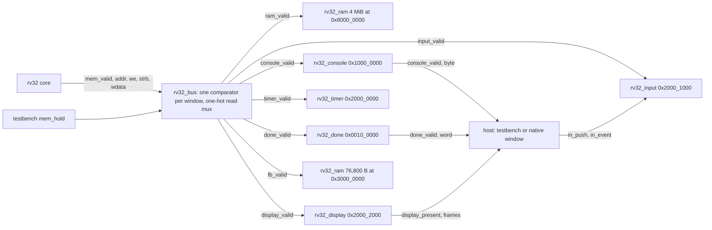

# RV32 machine: bus decoder, peripherals, and the device diagnostic

M5 turned the RV32I core into a computer. [rtl/rv32/rv32_soc.v](../rtl/rv32/rv32_soc.v) wires the core to a bus decoder and to every memory and device of the [machine contract](rv32.md): RAM, the console, the done register, a timer, an input queue, a display controller, and a 320×240 framebuffer. The [emulator](rv32-emulator.md) models the same devices with the same fault edges, and one firmware image, [programs/rv32/diag.c](../programs/rv32/diag.c), exercises all of them on both backends. The two backends are compared at the results level for that image, because a timer tick is a clock cycle on one and an executed instruction on the other; everything else stays trace-identical, as in M4.

## Implementation plan (M5)

1. Fix the contract before the Verilog: the four windows, the event word, the checkpoint hash, and the device-time rule ([rv32.md](rv32.md#behavior-fixed-in-m5)).
2. Move the RAM, console, and done register out of the testbench into RTL modules behind a bus decoder, with no change to any M4 trace or cycle count.
3. Decode the emulator's memory map with a region table so every window's rules are written once per device.
4. Add the timer, the display and framebuffer, and the input queue, one at a time on both backends, each with directed tests; then backpressure and reset tests.
5. Write the diagnostic, run it on the emulator, Icarus, and Verilator, and pin its checksum and frame hash independently.
6. Lint, synthesize, capture waves, record the numbers.

All six steps are complete; see [Milestone result](#milestone-result).

## The machine



Every slave has the same port: `clk`, `reset`, `valid`, `addr`, `we`, `strb`, `wdata` in; `rdata`, `ready`, `error` out. Only `valid` may gate a state change, a side-effect strobe, `ready` (plus a host-side input such as the input device's `push`), or a busy counter; `rdata` and `error` are combinational from the address, the strobe, and the device's state. A device that answers in the same cycle therefore costs the core nothing beyond the cycle the request is presented, which is why every M4 cycle count survived the move.

### The bus decoder is comparators and muxes

[rv32_bus.v](../rtl/rv32/rv32_bus.v) has no registers. One comparator per window turns the address into a select: the RAM and framebuffer windows are a subtraction and a compare against the size (`addr - base < bytes`), the 16-byte device windows compare the top 28 bits (`addr[31:4] == base[31:4]`), the console compares the top 29 bits, and the done register compares the whole address. The windows are disjoint, so at most one select is set, and `none_sel` is the NOR of all of them. Three rules compose in the four equations that follow:

- A request reaches a slave only as `<slave>_valid = req & <slave>_sel`, where `req = mem_valid & ~mem_hold`. While the host holds the bus no slave sees the request and `mem_ready` stays low: that is how the testbench models a slow memory, and it is why the stall counts did not change.
- Only RAM is fetchable. Every device select is gated with `~mem_fetch`, so a jump into a device window is answered like an unmapped address: `ready` and `error` in the same cycle, cause 1. The `mem_fetch` sideband became part of the contract in M5 for this reason.
- An address that selects nothing is answered at once with `ready` and `error` (`none_sel` is a term of both), which the core turns into cause 5 or 7 with the address in `mtval`.

`mem_ready` is `req` AND the OR of each select ANDed with its slave's `ready` (plus `none_sel`); `mem_error` is the OR of each select ANDed with its slave's `error` (plus `none_sel`); `mem_rdata` is a one-hot AND-OR mux of the slaves' read data. Adding a slave is one select, one `_valid`, one term in `none_sel`, and one term in each of the three ORs. Synthesis makes 525 cells of it, all logic.

### The devices

- **RAM** ([rv32_ram.v](../rtl/rv32/rv32_ram.v)): `WORDS` words from `BASE`, an asynchronous read of the whole aligned word (a continuous assign, so the array never enters a sensitivity list) and a strobe-masked write at the accepting edge, exactly the testbench's old model. The word index is the offset from `BASE` (`addr - BASE`, which synthesis folds away because the bases are aligned), so the memory does not care where the bus placed its window; the machine passes the bus's base to each instance and a tools test pins the two spellings equal. There is no initial block: the testbench zero-fills and loads the image through the hierarchy, and synthesis never sees a file. The same module is the framebuffer with `WORDS = 19200` at `0x3000_0000`, behind its own window: a pixel store is data movement and nothing else.
- **Console** ([rv32_console.v](../rtl/rv32/rv32_console.v)): the M2 edges (a byte store to +0, a byte read of +5 with strobe `0010`, everything else refused), a `tx_valid` strobe in the accepting cycle, and `BUSY_CYCLES`, a parameter that holds `ready` low for that many cycles before each byte: the contract's permission for a device to wait, exercised by one test. Status reads and refused accesses are never delayed.
- **Done register** ([rv32_done.v](../rtl/rv32/rv32_done.v)): stateless; a word store raises `done_valid` with the word, and the host still ends the run only after that instruction retires.
- **Timer** ([rv32_timer.v](../rtl/rv32/rv32_timer.v)): `elapsed` counts completed cycles from reset release; a read returns `elapsed + 1`, the number of the cycle that accepts it, so the first cycle reads 1 and a `lw` accepted in cycle `k` reads `k`. A word write loads `elapsed`, so the write's own cycle counts as the written value and a read `n` cycles later returns value + n. Offsets +4 to +12 and every byte or halfword access are refused.
- **Input** ([rv32_input.v](../rtl/rv32/rv32_input.v)): a 16-entry queue (`head`, `tail`, `count`) the host fills one event per cycle through `push`/`push_event`; EVENT pops at acceptance, COUNT reads `count`, KEYS is 32 flip-flops written by a variable bit-select as events arrive (`keys[code] <= press`). While `push` is high the device holds `ready` low for guest accesses, so a frame's burst lands whole before the guest's next load; the emulator queues the same burst in one step, and that is what keeps the sequence the guest reads identical. A push into a full queue is ignored and `full` lets the host report the drop.
- **Display** ([rv32_display.v](../rtl/rv32/rv32_display.v)): PRESENT raises `present` for the accepting cycle and counts a frame; FRAMES, WIDTH, and HEIGHT are read-only words. The pixels are not here: the host snapshots the framebuffer memory when it sees `present`, which is all "presenting" means; the [native window](rv32-window.md) does the same on the emulator.

Unused inputs (a write-only device ignores `wdata`, a 16-byte device ignores `addr[31:4]`) are consumed by one `wire unused_ok = &{1'b0, ...}` per module, which Verilator's `--Wall` accepts by its default `*unused*` rule and Yosys folds to a constant. The bus is written as assigns rather than one `always @*` so Verilator does not see a combinational loop through its own outputs.

## The testbench is now the host

[tests/rv32_tb.sv](../tests/rv32_tb.sv) instantiates `rv32_soc` and keeps everything it had: the plusargs, the stall generator (now driving `mem_hold` instead of `mem_ready`, so the `$random` draw points and every stall count are unchanged), the handshake checks, the retirement trace printer, and the halt line. What it added is the host side of the devices:

- Console bytes and the done word come from the strobes instead of from its own decode.
- `+input=FILE` reads the script (`frame N down|up KEY` lines, any number of them: the arrays grow as it is read, so the testbench accepts every script the emulator does) and pushes one event per cycle as soon as its frame has been reached: frame 0 from reset release, frame `N` from the cycle after the present that reaches `N` is accepted. A drop is reported on stderr as `rv32_tb: input queue full: dropped frame N event XXXXXXXX`, and the push stays presented through it: the device ignores a push into a full queue, and releasing the push for that cycle would let a guest pop waiting behind the burst slip in and make room for the next event, which the emulator, queueing the whole burst in one step, has already dropped. A guest that halts within a few cycles of a present leaves part of that frame's burst unpushed; since no pop can follow the last retirement, the halt accounts for those events against the queue's remaining room exactly as the pushes would have, so the drops it reports are the emulator's. Any event lost that way, or scheduled for a frame the guest never presented, turns a pass into a `$fatal` after the halt line unless `+allow-lost-events` says it was expected, matching the emulator's exit status; a guest that failed keeps its own outcome. The tokenizer is written by hand for portability: `\r` is not a SystemVerilog string escape (Icarus reads it as `r`, Verilator as a carriage return), `%d` accepts `x` and `z` by the standard, Icarus 13 cannot `case` on a string, and the two simulators count a failed `%s` differently; a script that opens but cannot be read (a directory) is refused with `$ferror`, since an empty script would otherwise pass silently.
- `+checkpoints=FILE` writes `frame N <hash>` in the cycle a present is accepted, hashing `dut.fb.mem` through the hierarchy the way a display would read its memory: every framebuffer store before the present has landed.
- `+reset-at=N` asserts reset again after counted cycle `N`, for two edges, and forgets the transaction in flight; the machine restarts at the reset PC while the counters and the trace continue. The test resets the machine while a store is being held and checks that it never landed and that the timer, frame count, and queue restarted.
- `+max-cycles` now defaults to 10,000,000 because the diagnostic needs about two million; `+wave` dumps the whole machine (`$dumpvars(0, rv32_tb.dut)`; the simulators skip the large memories), so the core's signals are one level down at `rv32_tb.dut.core`.

The image is loaded into `dut.ram.mem` with a hierarchical `$readmemh`, which Icarus 13 and Verilator 5.052 both accept; the memory module itself has no initial block.

## Device time in practice

The [contract](rv32.md#device-time) makes the timer the only device whose values differ between backends. The diagnostic shows what that costs and what it does not:

| Backend | Instructions | Of which traps | Cycles | Transfers | Stalls |
| --- | ---: | ---: | ---: | ---: | ---: |
| Emulator | 405,930 | 4 | — | — | — |
| RTL, Icarus, unstalled | 405,735 | 4 | 1,666,436 | 449,235 | 0 |
| RTL, Verilator, one stall per request | 405,725 | 4 | 2,115,617 | 449,223 | 449,223 |

The instruction counts differ by a few hundred because the wrap wait loop (`while (ticks >= 0xFFFFFF00)`) runs a different number of iterations when a tick is a cycle, an instruction, or a stalled cycle. The five console lines, the pass word, and both checkpoint lines are identical on all three runs, and the runner refuses to diff the traces in `--compare results` mode instead of reporting a mismatch it cannot interpret; it still requires the same faults in the same order (PC, word, cause, and value; only the step numbers differ). `make run-rv32-rtl` still compares the self-check trace for trace: that image never reads the timer.

## The diagnostic

`programs/rv32/diag.c`, with the trap stub in [trap.S](../programs/rv32/trap.S) and the script in [diag.input](../programs/rv32/diag.input), prints:

```
diag: timer ok
diag: faults 4
diag: display ae4eb605
diag: input 4
PASS 8bd87e9a
```

1. **Timer**: two reads differ and the difference is small; a write of `0xFFFF_FF00` is followed by a bounded wait until the count has wrapped through zero. No tick value is printed.
2. **Faults**: `mtvec` is pointed at `diag_trap_entry`, which saves the caller-saved registers, calls `diag_trap(mcause, mtval, mepc)` and resumes at the PC it returns. Four accesses fault on purpose (a word from `0x5000_0000`, a byte read of TICKS, a store to KEYS, the byte after the last pixel) and the recorded causes and `mtval` values are checked. The image checker admits `csr*` and `mret` for this image with `--allow-privileged`.
3. **Display**: WIDTH and HEIGHT are read; pixel (x, y) = (x ^ y) & 0xFF is written four pixels per word, a red box with byte stores, a green row with halfword stores; the whole frame is read back and hashed with the checkpoint hash (`h = ((h << 5) + h) ^ word` from 5381: shift, add, xor, no multiply). The hash is printed and the frame is presented; a blue box is added and presented again.
4. **Input**: after the first present, frame 1's three scripted events are queued: COUNT is 3, KEYS has only SPACE held (LEFT came and went), and the events pop in order. After the second present, the fourth event arrives and KEYS is clear.

Every value that is the same on both backends is folded into an FNV-1a checksum, as the self-check does, and `PASS 8bd87e9a` is that checksum. It is derived a second time in [tools/rv32_devices.py](../tools/rv32_devices.py) from the list of expected values and a Python render of the frame, without running anything; the tools tests require diag.c, the Makefile, and that derivation to agree, and the emulator and RTL tests require the guest's own readback hash, both backends' checkpoints, and the render to agree: four ways to the same 32 bits, none of which is a backend checking itself. `make run-rv32-diag-emu` also writes `build/rv32/frames/frame-0001.ppm` and `frame-0002.ppm` with the fixed RGB332 mapping, so the frame can be looked at before M6 shows it in a window.

## Inspect the waveforms

`make waves-rv32` adds `build/rv32/rtl/devices.vcd`, the `devices` program in [tools/rv32_asm.py](../tools/rv32_asm.py) run unstalled with a script of thirteen frame-0 events. Open it in [Surfer](https://app.surfer-project.org/) with `clk`, `reset`, `mem_valid`, `mem_ready`, `mem_addr`, `mem_rdata`, `in_push`, `in_event`, `console_valid`, `console_byte`, `display_present`, `display_frames` from `rv32_tb.dut`; `input_sel`, `display_sel`, `console_sel`, `none_sel` from `rv32_tb.dut.bus`; `count` and `ready` from `rv32_tb.dut.input_device`; `state` from `rv32_tb.dut.core`. Reset drops at 16 ns; counted cycle `k` is the rising edge at 25 + 10(k − 1) ns.

**The guest's first load waits for the host's burst.** `in_push` is high on the falling edges from 20 ns to 140 ns and `count` climbs from 1 at 25 ns to 13 at 145 ns: thirteen events, one per cycle, while the core fetches and decodes `lui` and `addi`. The `lw` of EVENT presents `mem_addr = 20001000` at 125 ns (after edge 11); `input_sel` is high but `input_device.ready` stays low through the edges at 135 and 145 ns because the host is still pushing, so `mem_ready` is low and the testbench counts two stalls (`cycles 85 = 4 × 12 + 5 × 7 + 2 stalls`). At 150 ns the push ends, `ready` rises, and the edge at 155 ns accepts the read with `mem_rdata = 80000100` (press of key 0); after the edge `count` drops to 12 and `mem_rdata` already shows the next event, `80000101`. The emulator, with no cycles, simply had all thirteen queued before its first instruction.

**A device answers in the cycle of the request.** The `lw` of WIDTH presents `20002008` at 325 ns; `display_sel` is already high (the decoder follows `mem_addr` even between requests; only `display_valid` waits for `req`), `mem_rdata` already shows `00000140` (320), `mem_ready` rises on the falling edge at 330 ns, and the edge at 335 ns accepts. No cycle is added: the decoder and the register are combinational. The `sw` to PRESENT presents at 375 ns, `display_present` is high from 380 to 385 ns, and `display_frames` becomes 1 on the accepting edge at 385 ns; that is the edge on which the testbench writes `frame 1 <hash>`. The `lw` of FRAMES accepted at 435 ns reads 1.

**A console byte leaves once.** The `sb` of `A` presents `10000000` at 635 ns; `console_valid` is high from 640 to 645 ns with `console_byte = 41`, the accepting edge; the testbench writes the byte in that cycle and never again.

## What synthesis built

`make synth-rv32-soc` synthesizes the whole machine with both memories shrunk to 64 words (`chparam -set RAM_WORDS 64 -set FB_WORDS 64`) so the count measures the decoder and the devices, not 4 MiB of flip-flops. Yosys 0.69+post, `check -assert`, no latches:

| Module | Cells | Flip-flops | Note |
| --- | ---: | ---: | --- |
| `rv32` core tree | 7,795 | 1,457 | 8,175 alone (`make synth-rv32`, unchanged); ABC's result for the untouched core moves with the module set around it (8,272 when both memories shared one parameterisation) |
| `rv32_bus` | 525 | 0 | seven comparators, the three ORs, the one-hot read mux |
| `rv32_input` | 1,486 | 561 | 16 × 32 queue, 32 keys, pointers and count |
| `rv32_console` | 144 | 32 | the busy counter |
| `rv32_timer` | 133 | 32 | the counter and its incrementer |
| `rv32_display` | 142 | 32 | the frame counter |
| `rv32_done` | 5 | 0 | |
| `rv32_ram` × 2 (64 words each) | 13,434 | 4,096 | 2,048 flip-flops and a 64-way read mux each; the `addr - BASE` index costs nothing because the bases are aligned |
| Total | 23,664 | 6,210 | |

The lesson of the table is the memories: the two 64-word memories together already cost more than the core, and the real 4 MiB RAM and 76,800-byte framebuffer would be memory macros, not flip-flops, on any target. The devices themselves are small; the input queue is the largest because it is a 16-word memory in flip-flops.

## Run and verify

```sh
make check-rv32-image           # builds and checks both images; the diagnostic with --allow-privileged
make run-rv32-diag-emu          # the diagnostic on the emulator: last line, checkpoints, and the frame pictures
make run-rv32-diag-rtl          # the diagnostic on Icarus, compared with the emulator at the results level (about 16 s)
make run-rv32-diag-rtl-verilator # the same on Verilator with one stall per request
make lint-rv32-soc              # verilator --Wall on the machine
make synth-rv32-soc             # yosys on the machine with 64-word memories
make waves-rv32                 # loop.vcd, full.vcd, and devices.vcd
make disasm-rv32-diag           # the diagnostic's listing
```

- `make test-rv32-tools`: 18 tests; the device helpers (hash, event word, script grammar, the nine-digit rule), the privileged-listing flag and the empty-listing refusal, the cross-language pin of the key table and the window bases, and the derivation of the diagnostic's frame hash and checksum from the pattern and the expected values.
- `make test-rv32-emu`: 31 tests; the timer counts executed instructions (a load inside instruction N reads N − 1, traps count, a write loads the count and wraps), the display and framebuffer at every width with checkpoints against the Python hash, the PPM frames, input events at frames, the drop and the rejection of a pass that lost an event, the script grammar errors, an unreadable script, an empty image, 45 fault rows across every window's offsets, widths, and directions, and the diagnostic when built.
- `make test-rv32-rtl` and `-verilator`: 36 tests on each simulator; all of M4 with identical traces and cycle counts, plus the timer read at hand-computed cycles 12 and 16 (the only trace line on which the backends differ), the display and framebuffer with checkpoints, input bursts and the RTL's hold, backpressure with `CONSOLE_BUSY=2` (two stalls per byte, none for the status read), the reset during a held store (the held keys clear too) and between a done word's acceptance and its retirement, a halt right after a present with the burst still landing, 47 fault rows, the diagnostic when built, and the runner's results-mode rejections. About 90 s on Icarus, 8 s on Verilator.
- `make test-rv32`: everything, in order, on both simulators, ending with lint and synthesis of the core and the machine.

## Exercises

1. **Decode an address by hand.** Take `0x2000_1008` and `0x3001_2C00` through the comparators in `rv32_bus.v`: which selects are set, what do `mem_ready` and `mem_error` become, and in which cycle? Then move the input window to `0x2000_1010` in the bus, the emulator, and `board.h` and watch which tests notice.
2. **A framebuffer store is ordinary data movement.** Write a program that fills the framebuffer and never presents; run it with `+checkpoints` and `--checkpoints`. Nothing is written, because nothing displayed it. Then present once and compare the line with `frame_hash` in Python over the bytes you expect.
3. **Device time.** Change the emulator's tick to two per instruction (or the RTL's to one per two cycles) and run `make run-rv32-diag-rtl`: the diagnostic still passes, because it never relies on the rate. Then print a tick value in the diagnostic and watch the results comparison fail on the console.
4. **A slower device.** Give the display a `BUSY_CYCLES` like the console's, so a present costs cycles, and extend `test_console_backpressure_holds_ready_per_byte` to it. The cycle formula's `stalls` term absorbs it; the trace does not change.
5. **A push that the guest can see.** Remove the `!push` term from the input device's `ready` and run `test_input_events_arrive_at_frames`: which value does the guest read early, and why does the emulator not have this problem?

## Milestone result

Completed on 2026-09-21 on branch `m5-rv32-devices`. From a clean `build/`, `make test-rv32` passes:

- `make test-rv32-tools` 17, `make test-rv32-rt` 6, `make test-rv32-emu` 30, `make test-rv32-rtl` 36 on Icarus and 36 on Verilator.
- `make run-rv32-qemu`, `run-rv32-emu`, `diff-rv32-qemu`, `run-rv32-rtl`, `run-rv32-rtl-verilator`: the self-check unchanged, `PASS 807d9fad`, 32,610 identical lines, 138,495 cycles.
- `make run-rv32-diag-emu`, `run-rv32-diag-rtl`, `run-rv32-diag-rtl-verilator`: `PASS 8bd87e9a`, checkpoints `frame 1 ae4eb605` and `frame 2 2acb5d85` on all three, the numbers in the table above.
- `make lint-rv32`, `lint-rv32-soc` clean; `make synth-rv32` 8,175 cells unchanged; `make synth-rv32-soc` 23,664 cells with 64-word memories, no latches.
- Counter, ALU, SAP8, and SIMD4 targets unchanged and passing.

Limitations that remained after M5: no palette and no host-time timer mode; no interrupts, so waiting is polling; the input script was the only keyboard; the RTL's memories are flip-flops in synthesis, not macros. M6 (completed 2026-09-21, [record](rv32-window.md)) built the native window on the emulator's framebuffer and input queue, software drawing, and Pong, replayed a 200-frame session on both simulators trace for trace against 200 checkpoints, and decided to keep RGB332 and to pace play by presents rather than add a host-time timer; no RTL file changed, so the numbers above stand.
