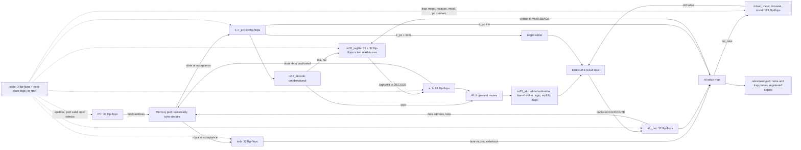

# From the emulator to a multicycle RV32I core

Start with the [RTL contract](rv32-rtl.md), keep [rv32.v](../rtl/rv32/rv32.v) open, and have `build/rv32/rtl/loop.rtl.trace`, `loop.vcd`, and `full.vcd` from `make waves-rv32` at hand. SAP8 taught controlled storage with an 8-bit accumulator and a three-state controller plus STOP. The new ideas here are a register file that is nothing but flip-flops and muxes, a controller that waits on a memory that may not answer, a retirement port that lets a hardware simulation be compared with a software emulator line for line, and, since M4, a trap that is a control transfer rather than a stop.

## 1. Connect the blocks



Every box that says flip-flops captures on a rising edge when the controller enables it; everything else is combinational and exists all the time. The memory itself, the console, and the done register are on the other side of the port (in the testbench until M4; since M5 in `rv32_ram` and the devices behind the bus decoder, [SoC record](rv32-soc.md)). Compare this with the emulator: `step()` in `rv32emu_core.c` is one function that reads, decodes, executes, and writes in program order. Here those are four or five separate edges, and the "function" is spread over hardware that is all active at once, selected by `state`.

## 2. Register writes are flip-flops, reads are muxes

[rv32_regfile.v](../rtl/rv32/rv32_regfile.v) declares `reg [31:0] regs [1:31]` and writes it in one clocked block. Yosys turns that into **992 flip-flops** (31 × 32) with synchronous reset and a per-register enable: the write address decodes to one enable, the write data fans out to every register, and only the enabled one captures. The register the emulator writes with `m->x[rd] = result` is a decoder plus 992 enables here.

The two read ports are `assign rdata1 = (raddr1 == 0) ? 0 : regs[raddr1]`. There is no "read" operation in hardware: each port is a 32-to-1 multiplexer, 32 bits wide, whose select is the register number. Yosys reports **1,380 `$_MUX_` cells** in the register file alone, most of the design's 1,972. Nothing in the core costs more than being able to read any two registers at once, which is why real cores are careful about how many read ports they add.

`x0` is not a register. `raddr == 0` bypasses the mux with a constant zero, and `we && waddr != 0` discards the write. The datapath never tests for `x0` anywhere else; the one other test, `rd_written` in `rv32.v`, feeds both the write enable and `retire_rd_we`, which is why the trace never shows an `x0=` field.

## 3. The ALU: one subtractor for every comparison, a barrel shifter, and a second adder

The emulator computes each operation in its own `case` arm. [rv32_alu.v](../rtl/rv32/rv32_alu.v) is one `case (op)` on `funct3`, with `alt` (`funct7[5]`) turning `add` into `sub` and `srl` into `sra`. Three things in it are worth seeing as gates:

- **The difference is computed once, 33 bits wide.** `diff = {1'b0, a} - {1'b0, b}` is `a + ~b + 1` (the [ALU lab](alu-to-gates.md) trick) with a borrow bit on top. That borrow *is* the unsigned comparison `ltu`. The signed comparison `lt` is the sign of the difference, unless the operands have different signs, in which case the negative one is smaller: `(a[31] != b[31]) ? a[31] : diff[31]`, one mux. `eq` is a 32-input NOR of the difference. `slt`, `sltu`, and all six branches read these three wires; `sub` reads `diff[31:0]`. The emulator's `(int32_t)a < (int32_t)b`, `a < b`, and `a == b` are three separate C comparisons; here they are one subtractor and two gates.
- **Shifts are a barrel shifter.** `a << shamt` with a five-bit amount is five stages of 32 muxes, each stage shifting by 1, 2, 4, 8, or 16 when its bit of the amount is set. `sra` is `$signed(a) >>> shamt`, the same shifter with the sign bit fed in from the top. Every shift already uses only `b[4:0]`, which is why a shift by 33 behaves as a shift by 1 on both backends without any masking logic in the core: the shifter has no wire for bit 5.
- **The ALU no longer sees the PC.** In M3 the operand mux fed `ir_pc` into the adder for `auipc`, `jal`, and branch targets, and the branch decision needed a separate equality comparator because the adder was busy. M4 needs `lt` and `ltu` too, so the roles are split the other way: the ALU always compares `a` with `b` for a branch, and a second adder, `pc_target = ir_pc + imm`, forms the PC-relative target in the same cycle. Two adders, but each does one job. `jalr`'s target is the ALU's `a + imm` with bit 0 cleared, no adder needed.

The operand muxes are now:

```verilog
wire [31:0] alu_a = is_lui ? 32'd0 : a;
wire [31:0] alu_b = (is_alu_reg || is_branch) ? b : imm;
```

and the `EXECUTE` result mux picks the CSR's old value, the `jalr` target, the PC-relative target, or the ALU result. The immediate decoder in [rv32_decode.v](../rtl/rv32/rv32_decode.v) is unchanged: a five-way mux over bit rearrangements of `ir`, with sign extension as twelve to twenty-one copies of `ir[31]` and no arithmetic at all.

## 4. Lanes: the strobe on the way out, muxes on the way back

A byte store puts the byte on all four lanes (`{4{b[7:0]}}`) and lets the strobe say which one the RAM keeps; a halfword store replicates the halfword. The strobe itself is a 2-to-4 decoder of `alu_out[1:0]` for a byte, a 1-to-2 decoder of `alu_out[1]` for a halfword, and `1111` for a word. `rv32_ram` (the testbench's RAM until M5) writes each lane under its own `if (mem_strb[i])`: four enables on one word, exactly like the register file's enables on one register.

A load gets the whole aligned word back in `mdr` and must pick lanes out of it. That is two muxes and some wire:

```verilog
wire [15:0] load_half = lane[1] ? mdr[31:16] : mdr[15:0];
wire [7:0]  load_byte = lane[0] ? load_half[15:8] : load_half[7:0];
```

Sign extension is then `{{24{load_byte[7] & ~funct3[2]}}, load_byte}`: twenty-four copies of one AND gate, whose other input is the "unsigned" bit of `funct3`. `lb` of `0x80` becomes `ffffff80` and `lbu` of the same byte `00000080` through one gate's worth of difference. The trace shows the raw byte for both, `mem[..]->00000080/1`, because the testbench narrows `mem_rdata` by the same strobe; only the register field differs.

## 5. The controller is three flip-flops plus next-state logic, and a trap is just another next state

`state` is a 3-bit register; the `case (state)` in `rv32.v` is the next-state logic and the enable logic together. Each arm says what to capture on this edge and which state comes next:

| State | Captures on the edge | Waits for |
| --- | --- | --- |
| `FETCH` | `ir`, `ir_pc` (and the retirement copies) | `mem_ready` |
| `DECODE` | `a`, `b` from the register file read muxes | nothing |
| `EXECUTE` | `alu_out`, `taken` | nothing |
| `MEM` | `mdr` | `mem_ready` |
| `WRITEBACK` | the register file, a CSR, `pc`, `in_trap`, the retirement port | nothing |

`FETCH` and `MEM` are the only states with `if (mem_ready)`: when the memory says no, the arm does nothing, so every register holds and the same request stays on the bus. That is the whole implementation of "held stable until accepted". The testbench checks it independently: on every edge that follows a stalled one, including the edge that finally accepts the request, it compares the request fields with what they were before and fails the run if anything moved.

The port outputs are combinational functions of `state` and `reset`:

```verilog
assign mem_valid = !reset && ((state == FETCH) || (state == MEM));
assign mem_fetch = mem_valid && (state == FETCH);
assign mem_addr = mem_fetch ? pc : alu_out;
assign mem_we = mem_valid && (state == MEM) && is_store;
assign mem_strb = !mem_valid ? 4'b0000 : mem_fetch ? 4'b1111 : strb;
```

So "issuing a request" is not an action; it is what the wires say while the controller is in one of two states. Leaving the state is what withdraws it.

**A trap is `take_trap`**, a task that any of the first four states can call. In M3 the same place held `stop`, which went to `HALT`. Now it writes four registers, `mepc`, `mcause`, `mtval`, and `pc <= mtvec`, sets `in_trap`, pulses `trap` for the testbench, and goes to `FETCH`. Nothing else changes: because every architectural write happens in `WRITEBACK` or at a store's acceptance in `MEM`, leaving earlier guarantees the instruction had no effect, which is what the trace contract requires of a trap line. The handler's first fetch is an ordinary `FETCH` from a different address. If `in_trap` is still set when a trap arrives, the task goes to `HALT` instead: that one flip-flop is the whole double-fault rule, and `WRITEBACK` clears it, which is "the handler retired an instruction".

The CSRs are four more 32-bit registers with two write paths each: the trap path above, and `csr_we` in `WRITEBACK` for `csrrw`/`csrrs`/`csrrc`, where `csr_new` is a three-way mux (operand, `old | operand`, `old & ~operand`) and `mtvec`/`mepc` drop their two low bits on the way in. Reading a CSR is a four-way mux on `ir[31:20]` into the `EXECUTE` result mux, so `rd` gets the old value by the same path as any ALU result. `mret` is one more input to the PC mux: `mepc` instead of `pc + 4`.

## 6. Inspect the waveforms

`make waves-rv32` runs the loop and the M4 program with `+stall=2` into `build/rv32/rtl/loop.vcd` and `full.vcd` (and, since M5, the devices program into `devices.vcd`, read in the [SoC record](rv32-soc.md#inspect-the-waveforms)). Open them in [Surfer](https://app.surfer-project.org/) and add, from `rv32_tb.dut.core` (the core is one instance inside the machine since M5; `clk` and `reset` are also at `rv32_tb.dut`): `clk`, `reset`, `state`, `mem_valid`, `mem_ready`, `mem_fetch`, `mem_addr`, `mem_we`, `mem_strb`, `mem_wdata`, `mem_rdata`, `ir`, `a`, `b`, `alu_out`, `mdr`, `load_value`, `rf_we`, `rd_value`, `pc`, `retire`, `retire_rd_we`, `retire_rd`, `retire_rd_value`, `trap`. Use unsigned decimal for `state` (`0 FETCH, 1 DECODE, 2 EXECUTE, 3 MEM, 4 WRITEBACK, 5 HALT`) and hex for the rest. Reset is high for the edges at 5 and 15 ns and drops at 16 ns; the first counted edge is 25 ns. With `+stall=2` every request costs three edges: two stalled, one accepting.

**A held request and a single retirement** (`loop.vcd`), the first instruction `auipc x5, 0` (word `00000297`):

| Rising edge | Observation |
| --- | --- |
| 25 ns | `FETCH`: `mem_valid=1`, `mem_fetch=1`, `mem_addr=8000_0000`, `mem_strb=1111`, `mem_ready=0`. Nothing captures. |
| 35 ns | Still `FETCH`, the same request on the bus, `mem_ready=0` again: the second stall cycle. |
| 45 ns | `mem_ready=1`: `ir` becomes `0000_0297`, `ir_pc` `8000_0000`, state becomes `DECODE`. `mem_valid` drops. |
| 55 ns | `DECODE` → `EXECUTE`: `a` and `b` capture `x0` (zero). |
| 65 ns | `EXECUTE` → `WRITEBACK`: `alu_out` becomes `8000_0000` (`pc_target`, `ir_pc + 0`). |
| 75 ns | `WRITEBACK` → `FETCH`: `x5` is written, `pc` becomes `8000_0004`, `retire=1` with `retire_rd=5`, `retire_rd_value=8000_0000`. The next fetch request is already on the bus in the same cycle. |

Six edges for one instruction: four states plus two stalls. The testbench prints trace line 1 at 76 ns, one nanosecond after the retiring edge, which is why `retire` is a registered pulse and not a combinational decode of `state`.

The three observations the roadmap asks for are in `full.vcd`, whose program is `program_full` in [tools/rv32_asm.py](../tools/rv32_asm.py): `x1 = 8000_0100`, `x2 = ffff_ff80`, then `sb x2, 0(x1)`, `lb x3, 0(x1)`, `lbu x4, 0(x1)`, `add x0, x3, x4`, a call, and the pass word.

**A stalled store**, `sb x2, 0(x1)` (word `0020_8023` at `8000_000c`):

| Rising edge | Observation |
| --- | --- |
| 205, 215 ns | `FETCH` stalled twice on `mem_addr=8000_000c`. |
| 225 ns | Fetch accepted; `DECODE`. |
| 235 ns | `a` = `x1` = `8000_0100`, `b` = `x2` = `ffff_ff80`; `EXECUTE`. |
| 245 ns | `alu_out` = `8000_0100`; `MEM`: `mem_valid=1`, `mem_we=1`, `mem_strb=0001` (lane 0 of the word), `mem_wdata=8080_8080` (the byte on every lane), `mem_fetch=0`. |
| 255, 265 ns | The store is held: address, strobe, and data unchanged while `mem_ready=0`. Memory has not been written. |
| 275 ns | Accepted: the RAM captures lane 0 on this edge, exactly once. `WRITEBACK`. |
| 285 ns | `retire=1`, no register write (`retire_rd_we=0`); the testbench prints `mem[80000100]<-00000080/1` from the transaction it recorded at 275 ns, narrowed by the strobe. |

Nine edges: five states plus four stalls. The write happened on the edge before the retiring one; the trace line still describes it as the instruction's effect because the testbench attributes every accepted data transaction to the next retirement.

**Sign extension**, `lb x3, 0(x1)` (word `0000_8183` at `8000_0010`), then `lbu x4, 0(x1)` (`0000_c203`):

| Rising edge | Observation |
| --- | --- |
| 335 ns | `EXECUTE` → `MEM` for the `lb`: from here `mem_addr=8000_0100`, `mem_strb=0001`, `mem_we=0`, and the RAM answers `mem_rdata=0000_0080` combinationally, the word the store built. |
| 345, 355 ns | Held while `mem_ready=0`. |
| 365 ns | Accepted: `mdr` captures `0000_0080`. From this edge `load_half` is `0080`, `load_byte` `80`, and `load_value` is `ffff_ff80`: bit 7 of the byte ANDed with "not unsigned" fans out to the top 24 bits. `rf_we=1`, `rd_value=ffff_ff80`. |
| 375 ns | `WRITEBACK`: `x3` and `retire_rd_value` both capture `ffff_ff80` on this edge, and the trace prints `x3=ffffff80 mem[80000100]->00000080/1` at 376 ns. |
| 455 ns | The `lbu` accepts the same word; `load_value` is `0000_0080` because `funct3[2]` is now 1 and the AND gates output zero. |
| 465 ns | `x4` captures `0000_0080`; the trace line's memory field is identical to the `lb`'s, only the register field differs. |

**A discarded `x0` write**, `add x0, x3, x4` (word `0041_8033` at `8000_0018`):

| Rising edge | Observation |
| --- | --- |
| 505 ns | `DECODE`: `a` captures `ffff_ff80`, `b` `0000_0080`. |
| 515 ns | `EXECUTE`: `alu_out` captures `ffff_ff80 + 0000_0080 = 0000_0000`. The adder ran; nothing about `x0` stopped it. From here `rd=0`, so `rd_written=0` and `rf_we=0` while `rd_value=0000_0000` sits on the write data bus unused. |
| 525 ns | `WRITEBACK`: `pc` becomes `8000_001c`, `retire=1` with `retire_rd_we=0`, and no register captured anything. The trace line is `7 80000018 00418033` and nothing else. |

Compare the directed test's `x0` case (`ADDI(0, 1, 5)` in `test_every_subset_instruction_directed`): the emulator skips the store with `if (writes_rd && rd != 0)`, the core computes the value and drops the enable. Both leave `x0` at zero; only the core did the arithmetic.

**A trap**, not in the two VCDs but easy to add: write any program from `test_traps_vector_through_the_handler_and_mret_returns` out with `write_image` and run `python3 -m tools.rv32_rtl --mode waves --image that.bin --allow-traps`, then watch `trap` pulse one cycle after the `DECODE` edge of the `ecall`, `pc` jump to `mtvec` on the same edge, `mepc` capture the `ecall`'s PC, and `in_trap` stay high until the handler's first `WRITEBACK`.

## 7. Instruction count versus clock count

The emulator's `steps` and the testbench's `steps` are the same number, 78 for the loop. The testbench's `cycles` is not:

| `+stall` | Cycles | Stalls | Transfers | Steps |
| ---: | ---: | ---: | ---: | ---: |
| 0 | 336 | 0 | 102 | 78 |
| 1 | 438 | 102 | 102 | 78 |
| 2 | 540 | 204 | 102 | 78 |
| 3 | 642 | 306 | 102 | 78 |
| seed 7 | 482 | 146 | 102 | 78 |

`make bench-rv32-rtl` prints this table. The loop retires 54 four-cycle instructions and 24 five-cycle ones: 4 × 54 + 5 × 24 = 336. Every transfer, fetch or data, costs one extra cycle per stall cycle, and there are 78 fetches plus 24 data accesses, so each unit of `+stall` adds 102. `test_cycle_count_follows_the_state_machine` asserts this formula; the seeded row draws 0 to 3 cycles per request and lands wherever `$random` puts it, with the trace unchanged. The seeded numbers are Icarus's: Verilator's `$random` sequence differs (479 cycles, 143 stalls for the same seed), and the test asserts the trace, not the seeded counts.

The self-check is the same formula at scale. `make run-rv32-rtl` prints:

```
cycles 138495 = 4 x 24555 + 5 x 8055 + 0 stalls; transfers 40665 = 32610 fetches + 8055 data
```

32,610 instructions, of which 8,055 (one in four) touch memory, in 138,495 cycles: 4.25 cycles per instruction, and 40,665 more per stall cycle. The M1 firmware that took QEMU a few milliseconds and the emulator under a millisecond is, on this core, a specific number of clock edges that no software backend could have predicted; that number is what M3 and M4 added to the project's knowledge of the machine.

The emulator cannot produce any of these numbers. The trace it defines deliberately says nothing about time so that the two backends can be compared. The 4-cycle floor is the price of a multicycle design with one memory port: the fetch of the next instruction cannot start until the current one has left `WRITEBACK`. A pipelined core would overlap them, and the roadmap keeps that as a later measured experiment against this baseline.

## 8. What synthesis actually built

`make synth-rv32` on Yosys 0.69+post: **8,175 generic cells**, no latches (`select -assert-none t:*LATCH*` passes), hierarchy preserved (M5 did not touch the core; the bus and the devices are counted in the [SoC record](rv32-soc.md#what-synthesis-built)):

| Module | Cells | Flip-flops | Muxes | M3 cells |
| --- | ---: | ---: | ---: | ---: |
| `rv32_regfile` | 4,190 | 992 | 1,380 | 4,177 |
| `rv32` (controller, datapath registers, CSRs, port, retirement port) | 2,560 | 465 | 323 | 1,244 |
| `rv32_alu` | 1,246 | 0 | 248 | 187 |
| `rv32_decode` | 179 | 0 | 21 | 169 |
| Total | 8,175 | 1,457 | 1,972 | 5,777 |

The register file is unchanged in function and its flip-flops are exactly 31 × 32 as before; its cell count moved by 13 because ABC's optimizer is sensitive to the whole netlist it receives, as M3 noted (the same file came out at 4,019, 4,177, and 4,400 in different trees). Flip-flop counts are exact; gate counts are reproducible for a given tree, not for a file.

The ALU grew from 187 cells (one adder) to 1,246: the 33-bit subtractor and its flags, the shifters (the source writes `<<`, `>>`, and `>>>` as three operators, each a five-stage barrel shifter to Yosys before optimization; how much ABC merged is not visible in the generic-gate count), and the three logic operations, all under one 8-way result mux. That is the price of RV32I's arithmetic; a core that cared would build one shifter and reverse the operand for the other direction, and the exercises below ask you to try it and measure.

The top level grew by 126 flip-flops. Its registers now add up to 498 bits: fifteen 32-bit registers (`pc`, `ir`, `ir_pc`, `a`, `b`, `alu_out`, `mdr`, `retire_pc`, `retire_insn`, `retire_rd_value`, `trap_value`, `mtvec`, `mepc`, `mcause`, `mtval`), `retire_rd` (5), `trap_cause` (4), `state` (3), and six single bits (`taken`, `in_trap`, `retire`, `trap`, `retire_rd_we`, `halted`). Yosys kept 465: as in M3, bits 30:0 of `retire_pc` are the same flip-flops as `ir_pc` (both capture `pc` on the same edge and differ only in reset value), and `mtvec[1:0]` are constant zero because both write paths mask them, so Yosys dropped them too. Two cells are `$_SDFFE_PP1P_` (reset to one): bit 31 of `pc` and of `ir_pc`. Two are `$_SDFF_PP0_` with no enable: `retire` and `trap`, which are assigned on every non-reset edge.

The 323 top-level muxes are the operand selects, the `EXECUTE` result select, the load lane and extension muxes, the `rd` value select, the PC select (`pc + 4`, target, `mepc`, `mtvec`), the strobe and data selects on the port, the CSR read and write muxes, and the cause and value selects in `take_trap`. The decoder is 179 gates with no storage. The counts exclude the RAM and devices, which are counted with the machine in the [SoC record](rv32-soc.md#what-synthesis-built); there is no placement, routing, or frequency claim.

## 9. Exercises

Optional experiments on the committed baseline; `make test-rv32-rtl` and `make run-rv32-rtl` say whether the core still agrees with the emulator and still runs the self-check.

1. **Merge `DECODE` into `EXECUTE`.** The register file reads are combinational, so `a` and `b` could feed the ALU muxes directly and the state could be dropped. Predict the new cycle formula (3 and 4 instead of 4 and 5) and the self-check's cycle count, update `cycle_relation` and the tests, and confirm no trace changes. What did the extra state buy, and when would you want it back?
2. **One shifter instead of two.** A left shift is a right shift of the bit-reversed operand, bit-reversed again. Replace the ALU's `<<` with that construction, re-synthesize, and compare the ALU's cell count with 1,246. Then check that shifts by 0, 1, 31, and 33 still match the emulator (`test_alu_operations_directed`).
3. **Random stalls with a seed sweep.** Run the self-check with `+stall-seed=1..20` and confirm every trace is identical while `cycles` varies. Then break the contract deliberately: change `mem_addr` to `pc` in `MEM` for one cycle and watch which check fires first, the held-request `$fatal` or the trace diff.
4. **A different double-fault policy.** The emulator document's first exercise asks what QEMU does instead of halting. Make the core do the same (keep vectoring, so `mtvec = 0` spins on fetch faults until `+max-cycles`), and decide whether the emulator should follow. Which policy makes a firmware bug easiest to find on a waveform?
5. **Count a trap's cycles.** The relation printed by `tools/rv32_rtl.py` is not exact when a run has trap lines. Work out the cost of each trap kind from the controller table (an illegal word leaves from `DECODE`, a refused load from `MEM`), extend `cycle_relation` to add them, and make the test in `test_traps_vector_through_the_handler_and_mret_returns` assert the exact count.
