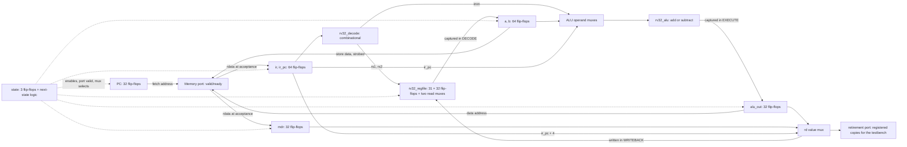

# From the emulator to a multicycle RV32I core

Start with the [RTL contract](rv32-rtl.md), keep [rv32.v](../rtl/rv32/rv32.v) open, and have `build/rv32/rtl/loop.rtl.trace` and `loop.vcd` from `make waves-rv32` at hand. SAP8 taught controlled storage with an 8-bit accumulator and a three-state controller. The new ideas here are a register file that is nothing but flip-flops and muxes, a controller that waits on a memory that may not answer, and a retirement port that lets a hardware simulation be compared with a software emulator line for line.

## 1. Connect the blocks



Every box that says flip-flops captures on a rising edge when the controller enables it; everything else is combinational and exists all the time. The memory itself, the console, and the done register are in the testbench, on the other side of the port. Compare this with the emulator: `step()` in `rv32emu.c` is one function that reads, decodes, executes, and writes in program order. Here those are four or five separate edges, and the "function" is spread over hardware that is all active at once, selected by `state`.

## 2. Register writes are flip-flops, reads are muxes

[rv32_regfile.v](../rtl/rv32/rv32_regfile.v) declares `reg [31:0] regs [1:31]` and writes it in one clocked block. Yosys turns that into **992 flip-flops** (31 × 32) with synchronous reset and a per-register enable: the write address decodes to one enable, the write data fans out to every register, and only the enabled one captures. The register the emulator writes with `m->x[rd] = result` is a decoder plus 992 enables here.

The two read ports are `assign rdata1 = (raddr1 == 0) ? 0 : regs[raddr1]`. There is no "read" operation in hardware: each port is a 32-to-1 multiplexer, 32 bits wide, whose select is the register number. Yosys reports **1,442 `$_MUX_` cells** in the register file alone, most of the design's 1,636. Nothing in the core costs more than being able to read any two registers at once, which is why real cores are careful about how many read ports they add.

`x0` is not a register. `raddr == 0` bypasses the mux with a constant zero, and `we && waddr != 0` discards the write, so the core never checks for `x0` anywhere else; the trace simply never shows an `x0=` field because `retire_rd_we` is computed from the same condition.

## 3. The operand muxes and the one adder

The emulator computes `pc + imm`, `a + imm`, `a + b`, `a - b`, and `0 + imm` (`lui`) in separate `case` arms. The core has one adder, [rv32_alu.v](../rtl/rv32/rv32_alu.v), fed by two muxes:

```verilog
wire [31:0] alu_a = uses_pc ? ir_pc : is_lui ? 32'd0 : a;
wire [31:0] alu_b = is_alu_reg ? b : imm;
```

`uses_pc` is true for `auipc`, branches, and `jal`, so branch targets and `auipc` results come out of the same adder that computes `addi` and load/store addresses. Subtraction is `a + ~b + 1` with the subtract bit as the carry-in, the same trick as in the [ALU lab](alu-to-gates.md). The branch decision is a separate equality comparator on `a` and `b` (`rs_equal`), because the adder is busy with the target address in the same cycle.

The immediate decoder in [rv32_decode.v](../rtl/rv32/rv32_decode.v) is a five-way mux over bit rearrangements of `ir`. Every RV32I format puts the sign bit at `ir[31]`, so sign extension is `{{20{insn[31]}}, ...}`: twenty copies of one wire. There is no arithmetic in it at all.

## 4. The controller is three flip-flops plus next-state logic

`state` is a 3-bit register; the `case (state)` in `rv32.v` is the next-state logic and the enable logic together. Each arm says what to capture on this edge and which state comes next:

| State | Captures on the edge | Waits for |
| --- | --- | --- |
| `FETCH` | `ir`, `ir_pc` (and the retirement copies) | `mem_ready` |
| `DECODE` | `a`, `b` from the register file read muxes | nothing |
| `EXECUTE` | `alu_out`, `taken` | nothing |
| `MEM` | `mdr` | `mem_ready` |
| `WRITEBACK` | the register file, `pc`, the retirement port | nothing |

`FETCH` and `MEM` are the only states with `if (mem_ready)`: when the memory says no, the arm does nothing, so every register holds and the same request stays on the bus. That is the whole implementation of "held stable until accepted". The testbench checks it independently: on every edge that follows a stalled one, including the edge that finally accepts the request, it compares the request fields with what they were before and fails the run if anything moved.

The port outputs are combinational functions of `state`:

```verilog
assign mem_valid = (state == FETCH) || (state == MEM);
assign mem_addr = mem_fetch ? pc : alu_out;
assign mem_we = (state == MEM) && is_store;
```

So "issuing a request" is not an action; it is what the wires say while the controller is in one of two states. Leaving the state is what withdraws it.

A stop (`fault` or `unsupported`) is a transition into `HALT` from whichever state detected it. Because every architectural write happens in `WRITEBACK` or at a store's acceptance in `MEM`, stopping earlier guarantees the instruction had no effect, which is what the trace contract requires of a trap line.

## 5. Inspect the waveform

`make waves-rv32` runs the loop with `+stall=2` into `build/rv32/rtl/loop.vcd`. Open it in [Surfer](https://app.surfer-project.org/) and add, from `rv32_tb.dut`: `clk`, `reset`, `state`, `mem_valid`, `mem_ready`, `mem_fetch`, `mem_addr`, `mem_we`, `mem_wstrb`, `mem_rdata`, `ir`, `a`, `b`, `alu_out`, `pc`, `retire`, `retire_rd`, `retire_rd_value`. Use unsigned decimal for `state` (`0 FETCH, 1 DECODE, 2 EXECUTE, 3 MEM, 4 WRITEBACK, 5 HALT`) and hex for the rest. Reset is high for the edges at 5 and 15 ns and drops at 16 ns; the first counted edge is 25 ns.

**A held request and a single retirement**, the first instruction `auipc x5, 0` (word `00000297`):

| Rising edge | Observation |
| --- | --- |
| 25 ns | `FETCH`: `mem_valid=1`, `mem_fetch=1`, `mem_addr=8000_0000`, `mem_ready=0`. Nothing captures. |
| 35 ns | Still `FETCH`, the same request on the bus, `mem_ready=0` again: the second stall cycle. |
| 45 ns | `mem_ready=1`: `ir` becomes `0000_0297`, `ir_pc` `8000_0000`, state becomes `DECODE`. `mem_valid` drops. |
| 55 ns | `DECODE` → `EXECUTE`: `a` and `b` capture `x0` (zero). |
| 65 ns | `EXECUTE` → `WRITEBACK`: `alu_out` becomes `8000_0000` (`ir_pc + 0`). |
| 75 ns | `WRITEBACK` → `FETCH`: `x5` is written, `pc` becomes `8000_0004`, `retire=1` with `retire_rd=5`, `retire_rd_value=8000_0000`. The next fetch request is already on the bus in the same cycle. |

Six edges for one instruction: four states plus two stalls. The testbench prints trace line 1 at 76 ns, one nanosecond after the retiring edge, which is why `retire` is a registered pulse and not a combinational decode of `state`.

**A stalled store**, `sw x7, 0(x5)` (word `0072a023` at `8000_0010`, the loop's `sum = 0`):

| Rising edge | Observation |
| --- | --- |
| 265, 275 ns | `FETCH` stalled twice on `mem_addr=8000_0010`. |
| 285 ns | Fetch accepted; `DECODE`. |
| 295 ns | `a` = `x5` = `8000_0100`, `b` = `x7` = 0; `EXECUTE`. |
| 305 ns | `alu_out` = `8000_0100`; `MEM`: `mem_valid=1`, `mem_we=1`, `mem_wstrb=1111`, `mem_wdata=0`, `mem_fetch=0`. |
| 315, 325 ns | The store is held: address, strobe, and data unchanged while `mem_ready=0`. Memory has not been written. |
| 335 ns | Accepted: the testbench RAM captures the word on this edge, exactly once. `WRITEBACK`. |
| 345 ns | `retire=1`, no register write (`retire_rd_we=0`); the testbench prints `mem[80000100]<-00000000/4` from the transaction it recorded at 335 ns. |

Nine edges: five states plus four stalls. The write happened two edges before the instruction retired; the trace line still describes it as the instruction's effect because the testbench attributes every accepted data transaction to the next retirement.

## 6. Instruction count versus clock count

The emulator's `steps` and the testbench's `steps` are the same number, 78 for the loop. The testbench's `cycles` is not:

| `+stall` | Cycles | Stalls | Transfers | Steps |
| ---: | ---: | ---: | ---: | ---: |
| 0 | 336 | 0 | 102 | 78 |
| 1 | 438 | 102 | 102 | 78 |
| 2 | 540 | 204 | 102 | 78 |
| 3 | 642 | 306 | 102 | 78 |
| seed 7 | 482 | 146 | 102 | 78 |

`make bench-rv32-rtl` prints this table. The loop retires 54 four-cycle instructions and 24 five-cycle ones: 4 × 54 + 5 × 24 = 336. Every transfer, fetch or data, costs one extra cycle per stall cycle, and there are 78 fetches plus 24 data accesses, so each unit of `+stall` adds 102. `test_cycle_count_follows_the_state_machine` asserts this formula; the seeded row draws 0 to 3 cycles per request and lands wherever `$random` puts it, with the trace unchanged. The seeded numbers are Icarus's: Verilator's `$random` sequence differs (479 cycles, 143 stalls for the same seed), and the test asserts the trace, not the seeded counts.

The emulator cannot produce any of these numbers. The trace it defines deliberately says nothing about time so that the two backends can be compared; the cycle count is the first thing M3 knows that M2 does not. The 336-cycle floor is the price of a multicycle design with one memory port: the fetch of the next instruction cannot start until the current one has left `WRITEBACK`. A pipelined core would overlap them, and the roadmap keeps that as a later measured experiment against this baseline.

## 7. What synthesis actually built

`make synth-rv32` on Yosys 0.69+post: **5,644 generic cells**, no latches (`select -assert-none t:*LATCH*` passes), hierarchy preserved:

| Module | Cells | Flip-flops | Muxes |
| --- | ---: | ---: | ---: |
| `rv32_regfile` | 4,019 | 992 | 1,442 |
| `rv32` (controller, datapath registers, port, retirement port) | 1,243 | 339 | 172 |
| `rv32_decode` | 195 | 0 | 0 |
| `rv32_alu` | 187 | 0 | 0 |
| Total | 5,644 | 1,331 | 1,636 |

The register file is 71 percent of the core, and its flip-flops are exactly 31 × 32. The top level's 339 flip-flops need a closer look. The registers declared there add up to 370 bits: `pc`, `ir`, `ir_pc`, `a`, `b`, `alu_out`, `mdr`, `retire_pc`, `retire_insn`, `retire_rd_value`, `fault_value` (11 × 32), `retire_rd` (5), `fault_cause` (4), `state` (3), and six single bits. Yosys removed 31: `retire_pc` and `ir_pc` both capture `pc` on the same edge and differ only in their reset value, so bits 30:0 are the same flip-flop and Yosys kept one copy for both. The remaining `retire_pc` bit is bit 31, the one that resets to a different value. Two cells are `$_SDFFE_PP1P_` (reset to one): bit 31 of `pc` and of `ir_pc`, because the reset PC is `0x8000_0000`.

The 172 top-level muxes are the operand selects (`alu_a`, `alu_b`), the `rd` value select, the address select on the port, and the per-register enables' data paths. The decoder is 195 gates with no storage, as its `always @*` blocks intend. The counts exclude the RAM and devices, which live in the testbench; there is no placement, routing, or frequency claim.

## 8. Exercises

Optional experiments on the committed baseline; `make test-rv32-rtl` says whether the core still agrees with the emulator.

1. **Merge `DECODE` into `EXECUTE`.** The register file reads are combinational, so `a` and `b` could feed the ALU muxes directly and the state could be dropped. Predict the new cycle formula (3 and 4 instead of 4 and 5), update `test_cycle_count_follows_the_state_machine`, and confirm the trace does not change. What did the extra state buy, and when would you want it back?
2. **Add `jalr`.** It is `unsupported` today. It needs `a + imm` with bit 0 cleared as the target and `ir_pc + 4` as the result; both exist. Move it from the unsupported list to the subset, add the misaligned-target check, and extend the directed test. Notice that `ret` is now possible, so a C function could return.
3. **Random stalls with a seed sweep.** Run the loop with `+stall-seed=1..20` and confirm every trace is identical while `cycles` varies. Then break the contract deliberately: change `mem_addr` to `pc` in `MEM` for one cycle and watch which check fires first, the held-request `$fatal` or the trace diff.
4. **Vector instead of halting.** Add `mtvec`, `mepc`, `mcause`, `mtval` as registers and make a fault load `pc` from `mtvec` instead of entering `HALT`. The emulator already double-faults when `mtvec` is zero; decide what the core should do in that case and write the test before the Verilog. This is the first step of M4.
