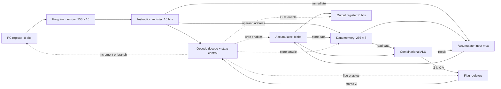

# From the ALU to a running CPU

Start with the [SAP8 specification](sap8.md), then keep [sap8.v](../rtl/sap8/sap8.v) open. The new idea is controlled storage: instructions select which registers capture which combinational values on a clock edge.

## 1. Connect the blocks



Register boxes capture on rising edges; arrows between them are combinational data/control paths. The diagram omits reset wiring, the PC incrementer, and trace registers for readability. Memories live outside the core in this simulation.

The CPU does not call the ALU like a software function. The instantiated `alu arithmetic (...)` exists continuously, connected to accumulator Q outputs and the current memory-read bus. Only ADD/SUB execute edges enable capturing its result and flags.

## 2. Recover the register pattern

The counter already introduced `always @(posedge clk)` and nonblocking `<=`. The CPU uses that pattern for every state register:

```verilog
FETCH: begin
    instruction <= program_data;
    instruction_pc <= pc;
    pc <= pc + 8'd1;
    state <= DECODE;
end
```

All right-hand sides use the values present at the edge. The instruction address captures the **old** PC while PC itself advances. Writing these statements in sequence does not make `instruction_pc` receive the incremented PC. Nonblocking scheduling models registers capturing concurrently.

`pc + 8'd1` is a combinational incrementer like the counter's. The PC register selects between holding, incrementing, a branch operand, and reset zero. That selection becomes mux/control logic around eight flip-flops.

For the accumulator, LDI selects the instruction's low byte, LDA selects memory-read data, and ADD/SUB select the ALU result. Other instructions omit an accumulator assignment, intentionally retaining its flip-flop state. Unlike the ALU's unclocked block, this omission does not infer a latch.

**Predict:** during STA, must the accumulator change? No. Its existing value drives memory's write-data input, while the accumulator register holds it.

## 3. Decode plus a state register makes the controller

The two-bit `state` register cycles through FETCH → DECODE → EXECUTE → FETCH. HLT/fault lead to STOP. Comparing state and opcode generates control signals such as:

```verilog
assign data_write_enable = !reset && !halted &&
                           (state == EXECUTE) && (opcode == STA);
```

Equality comparisons become gate networks; the Boolean AND conditions ensure memory writes only for the intended phase and instruction. The state register remembers **which phase comes next**. The decode gates do not need their own clock.

The testbench memory writes at `posedge clk` when this signal is high. At that same edge the CPU leaves EXECUTE, causing the strobe to fall after the state update. Both clocked processes sample the pre-edge values, so exactly one write occurs. Gating with reset prevents a pending store from reaching memory at a reset edge.

DECODE occupies a full teaching cycle even though the small asynchronous memories do not require it. This makes instruction fetch, operand selection, and execution distinguishable in the waveform. The price is three clocks per instruction, or one-third instruction per clock in this model. Faster clock rates would need a timing analysis, which generic synthesis does not provide.

**Predict:** JZ changes PC at EXECUTE if stored Z is high. It does not change the instruction currently being executed; the next FETCH captures the branch target's word.

## 4. Flags are now remembered

The standalone ALU's flags described its current inputs. The CPU's flags are four flip-flops. Arithmetic captures all four, loads set Z/N and clear C/V, and stores/branches/OUT/HLT hold them.

After ADD captures a result, the accumulator changes and immediately feeds that new value back into the ALU. Its live combinational result can therefore change again. For the addition example, capture `5 + 7 = 12`, then the live ALU can compute `12 + 7 = 19` while the old ADD instruction remains in the instruction register. The stored accumulator remains 12 until another instruction enables a write. This is normal and is a useful reason to distinguish `acc` from `arithmetic.result` in Surfer.

JZ reads the stored `zero` flag, not the ALU's changing `alu_zero` wire. No combinational feedback loop exists through the accumulator because flip-flops break the path between cycles.

## 5. Inspect the waveforms

Run `make waves-sap8`. Open `build/sap8.vcd` for addition, then `build/sap8-loop.vcd` for the loop. Add these signals from `sap8_tb.dut`:

- `clk`, `reset`, `state`, `pc`, `instruction`, `retired`, `retire_pc`.
- `acc`, `out`, `zero`, `negative`, `carry`, `overflow`.
- `data_address`, `data_read`, `data_write`, `data_write_enable`, `halted`, `fault`.

Use hex for data/instructions/addresses, unsigned decimal for state (`0=FETCH`, `1=DECODE`, `2=EXECUTE`, `3=STOP`), and binary for controls. Ignore unspecified state before the reset edge at 15 ns. Reset deasserts at 20 ns; fetch begins at 25 ns.

| Rising edge | Addition program observation |
| --- | --- |
| 25 ns | Fetch `0007` (LDI 7); PC becomes 1 and state becomes DECODE; accumulator is still 0 |
| 35 ns | State becomes EXECUTE; accumulator remains 0 |
| 45 ns | LDI commits: accumulator becomes 7; `retired=1`, `retire_pc=0` |
| 65 ns | STA enters EXECUTE; address is `f0`, data is 7, write-enable goes high |
| 75 ns | Memory captures 7; write-enable falls as state returns to FETCH |
| 135 ns | ADD commits: accumulator becomes `0c` (12) |
| 165 ns | OUT captures `0c`; accumulator and flags hold |
| 195 ns | HLT enters STOP; output stays `0c`; PC is 6 because fetch already advanced it |

The text trace samples 1 ns after each execute edge, so its first line says **46 ns**, not 45 ns. Trace field `pc` is the **executed instruction's address**; `next` is the post-execution PC. For example:

```text
136 ns pc=03 instruction=03f0 next=04 acc=0c ZNCV=0000 out=00 halt=0 fault=0
```

For the loop, watch the store lines in `build/sap8-loop.trace`: sum at `f2` becomes 3, 5, then 6; count at `f1` becomes 2, 1, then 0. At 675 ns SUB makes the accumulator zero with C=1 (no borrow). STA and JMP preserve these flags. LDA at 765 ns keeps Z=1 but clears C. JZ at 795 ns branches to address 8. OUT at 855 ns exposes 6, and HLT at 885 ns stops execution.

Both simulator traces were checked at common timestamps after reset: 44 snapshots for addition and 182 for the loop, each comparing 20 DUT signals. They agree. These are delay-free RTL waveforms; they do not depict physical propagation delays.

## 6. What synthesis actually built

On Yosys 0.69+post, `make synth-sap8` produced **395 generic primitive cells** across the CPU and its ALU:

| Component | Cells |
| --- | ---: |
| Combinational ALU, preserved as a submodule | 223 |
| Other combinational logic, including 27 muxes | 91 |
| Flip-flops with synchronous reset/enable | 81 |
| Latches | 0 |

The 81 stored bits have a direct explanation: PC 8 + accumulator 8 + output 8 + flags 4 + halt/fault 2 + state 2 + instruction 16 + instruction address 8 + retirement pulse/address/instruction 25. Some are for observability rather than executing the ISA itself. The netlist uses 79 `$_SDFFE_PP0P_`, one `$_SDFFE_PP1P_` (reset-to-one Z), and one `$_SDFF_PP0_` cell.

This hierarchical synthesis retains the complete eight-operation ALU even though the CPU selects only ADD/SUB. Flattening and further optimization could remove unused paths; that is an optional area experiment. The reported count includes neither program nor data memory, because those arrays are in the testbench. There is no FPGA placement, routing, or frequency claim.

## 7. Exercises before moving on

1. Predict the loop's first three instruction traces, including PC and Z. Then compare them with the saved trace.
2. Change initial count in `.data 0xf1 3` to 0. Predict output 0 and the instruction count before running. Why must JZ use a stored flag? Keep the baseline in Git and supply updated expected output/count when running your variant.
3. Move OUT into the loop after storing the sum. Which values should the output register show, and when? Update your expected instruction count too.
4. Sketch a load with a synchronous one-cycle memory read. Identify where an additional state or operand register is needed before changing the interface. The current core does not support that timing contract.

The scalar CPU milestone ends here. The next planned project is a four-lane compute engine; it has not been started.
