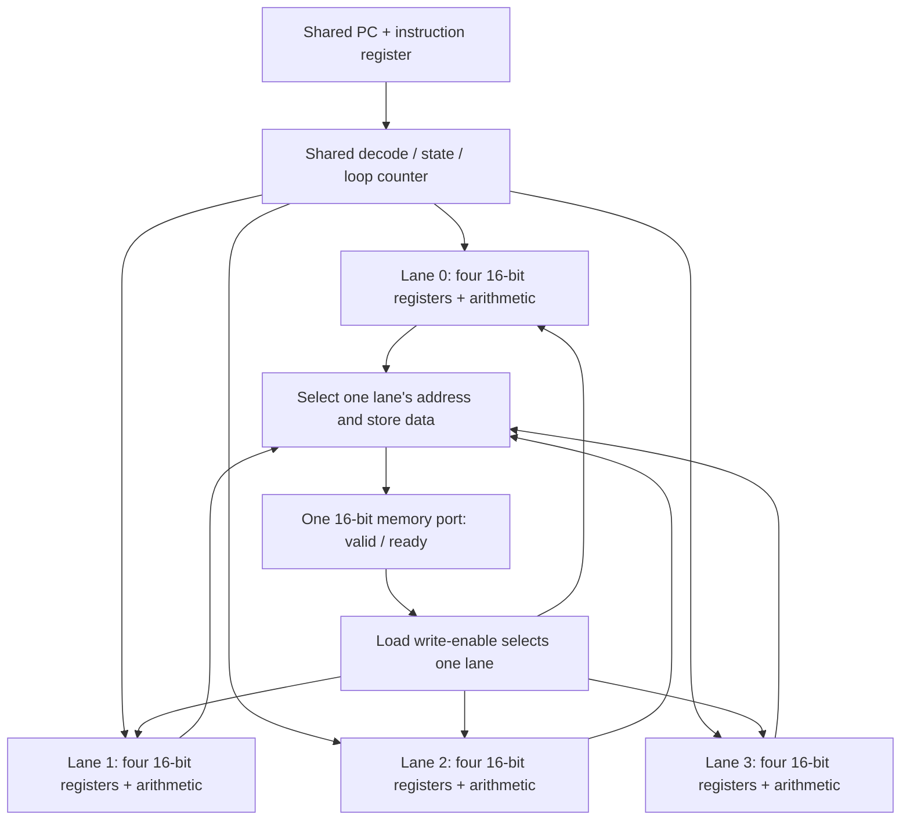

# One instruction, four data paths

Read the [SIMD4 contract](simd4.md) with [simd4.v](../rtl/simd4/simd4.v), the [vector kernel](../programs/simd4/vector_add.py) and the [matrix kernel](../programs/simd4/matrix_mac.py). This milestone changes how much data one instruction handles, while keeping a single instruction stream. Sections 1 to 6 are the vector-add milestone; sections 7 to 10 add the A1 multiply/accumulate datapath and the matrix kernel.

## 1. Duplicate the datapath, share the controller

SAP8 had one accumulator and one instruction stream. SIMD4 has four register banks and arithmetic paths, all controlled by one PC, instruction register, decoder, and loop counter.



All four lanes execute `ADD r3, r1, r2` on the same edge, each using its own operands. A `LANE r0` instruction gives lanes different starting indices: 0, 1, 2, and 3. Those values become addresses for distinct elements, while the shared decoder still issues one instruction.

The Verilog `generate for` creates repeated hardware during elaboration. It does not make a runtime loop that computes lane 0, then lane 1. In contrast, `memory_lane` is an actual register that advances across clock edges to serialize memory transfers.

**Predict:** after `LANE r0` followed by `ADDI r0,r0,4`, the four r0 values are 4, 5, 6, and 7. They change together.

## 2. What each construct builds

| RTL construct | Circuit interpretation |
| --- | --- |
| `reg [15:0] r [0:3]` inside each generated lane | Four 16-bit state registers per lane: 256 lane-state bits in the four-lane design |
| `r[ra]`, `r[rb]` | Muxes select source registers from a bank |
| `r[rd] <= ...` in a clocked process | Destination decoding enables the selected register at the edge |
| `r[ra] + r[rb]` / `r[ra] + immediate` | Per-lane addition and selection logic; the low 16 bits are captured |
| `wire ... = ...` | A continuous connection/expression, not a one-time variable initialization |
| `address_base[memory_lane]` | A mux selects one lane's address for the shared port |
| `memory_lane == lane` on LOAD | One lane's destination captures the accepted read value |
| `state` / `loop_count` | Shared control storage; no per-lane PC or branch decision |
| `register_state` / named r0–r3 aliases | Wiring for observation; no additional storage |

Register aliases are allowed. For `ADD r0,r0,r1`, nonblocking assignment means each lane samples the old r0 and r1 before r0 updates. For a load into its address register, the accepting edge uses the old address; subsequent instructions see the loaded value.

The decoder ignores fields that an operation does not use. Synthesis may simplify, share, or reorganize expressions, so source operators are not a literal gate count. This is still clocked storage connected by combinational paths, just as in SAP8.

## 3. Use a shared loop to cover a vector

The kernel's r0 contains the element index. Each iteration loads A[r0] and B[r0], computes their sum, stores C[r0], and increments r0 by the number of lanes. The scalar loop counter counts groups.

For eight elements on four lanes:

| Group | Lane 0 | Lane 1 | Lane 2 | Lane 3 |
| --- | ---: | ---: | ---: | ---: |
| First | 0 | 1 | 2 | 3 |
| Second | 4 | 5 | 6 | 7 |

Both LOOP decisions apply to all lanes. There is no instruction for “only lane 2 branches.” Length must be divisible by lane count because all lanes remain active. A future tail mask would need explicit semantics and tests.

Addition wraps at 16 bits: `ffff + 0001 = 0000`, and `8000 + 8000 = 0000`. No carry or signed-overflow flag is stored. These are integer bit patterns; interpreting `8000` as −32768 changes its meaning, not the low-bit addition circuit.

## 4. Follow a stalled request

LOAD/STORE first enter MEMORY with `memory_lane=0`. The selected lane drives address and data; `mem_valid=1` means they describe a request.

At a rising edge:

- If ready is low, no transfer occurs. Lane, address, direction, data, and architectural state hold; the stall/cycle counters advance.
- If valid and ready are high, one word transfers. LOAD writes only that lane's register; STORE updates external memory. The lane selector advances.
- After the last lane, the instruction retires and the core returns to FETCH.

The responder controls `mem_ready`. It may hold it low for many clocks. The engine must not skip lanes, change a pending address, duplicate a store, or count a retirement during those waits. The scoreboard checks these properties as well as the final answer.

Memory effects are visible per accepted transfer. If reset occurs after lane 0's store but before lane 1's, lane 0's write remains. Reset suppresses the pending request and clears internal state at the reset edge. It does not undo external effects. The cancellation tests check both partial loads and partial stores, then reload the test inputs and launch again.

## 5. Read the two waveforms

Run `make waves-simd4`. Open `build/simd4/icarus/vector-wave.vcd` and `stalled-wave.vcd` in Surfer. Verilator emits equivalent files under `build/simd4/verilator/`. Both examples add eight elements with four lanes; only memory readiness changes.

Add `clk`, `reset`, `start`, `busy`, `done`, `state`, `pc`, `instruction`, `loop_count`, `memory_lane`, `mem_valid`, `mem_ready`, `mem_write`, `mem_address`, `mem_write_data`, `mem_read_data`, `retired`, `cycles`, and `stalls` from `simd4_tb.dut`. Expand each `lanes[0]` through `lanes[3]` scope and add its named r0–r3 wires. Use hex for operands and decimal for state/lane/counters.

The initial reset is sampled at 15 ns, and launch at 35 ns. The testbench also pulses start while busy to verify it is ignored. The clock period is 10 ns; the performance counters count edges, not nanoseconds.

| No-wait trace | Observation |
| --- | --- |
| 55 ns | LANE commits r0 = 0, 1, 2, 3 |
| 75 ns | Shared loop counter becomes 2 |
| 105, 115, 125, 135 ns | First LOAD accepts one A element per edge, in lane order |
| 165, 175, 185, 195 ns | Second LOAD fills r2 from B |
| 215 ns | All four r3 registers capture sums together: `0000`, `8000`, `0000`, `ffff` |
| 245, 255, 265, 275 ns | STORE writes these results to `80`, `81`, `82`, `83` |
| 295 ns | Every lane's r0 advances by four |
| 315 ns | LOOP decrements the shared counter to 1 and branches to PC 2 |

Transfer lines in the `.log` files use the actual accepting edge. Retirement lines sample 1 ns afterward, so the ADD line says **216 ns**. The packed `regs` trace places lane 0/r0 in its least significant 16 bits; named waveform aliases are easier to read.

The stalled trace repeats 0, 1, 2, 3 extra waits across successive transfers. The first LOAD accepts at 105, 125, 155, and 195 ns. At 115 ns, lane 1 is waiting: inspect the stable address and register state, and watch `stalls` increment. ADD consequently commits at 335 ns. Both runs produce identical results: the no-wait run uses 54 cycles and 0 stalls; the varying-wait run uses 90 cycles and 36 stalls. Each transfers 24 words and retires 15 instructions.

The generated Icarus and Verilator waveforms agree on 41 inspected signals, including all 16 lane registers: 116 common snapshots after launch for the no-wait run and 188 for the stalled run. All four first-group ADD results were also checked at their capture edge.

## 6. Explain the speedup with measured cycles

`make bench-simd4` holds the vector length at **32 elements** and sweeps lane count plus ready delay. Results are saved in `build/simd4/icarus/benchmark.json`; the Verilator suite generates a matching report. Every run performs 64 reads and 32 writes, or **96 transfers**.

| Extra wait edges per transfer | 1 lane | 2 lanes | 4 lanes | 1-lane / 4-lane speedup |
| --- | ---: | ---: | ---: | ---: |
| 0 | 486 cycles | 294 cycles | 198 cycles | 2.45× |
| 1 | 582 cycles | 390 cycles | 294 cycles | 1.98× |
| 3 | 774 cycles | 582 cycles | 486 cycles | 1.59× |

The `wait` field in reports is a **mode**: 0 means no waits, 1 means one extra wait, 2 means three extra waits, and 3 is the repeating 0/1/2/3 pattern. The port remains one word wide; ready delays reduce its available transfer rate. This experiment varies offered memory bandwidth, not the number of physical memory ports.

For N elements and L lanes, the kernel retires `3 + 6N/L` instructions and performs `3N` transfers. The three instructions outside the loop are LANE, SETLOOP, and HLT. Each instruction pays one FETCH and one EXECUTE edge; memory instructions additionally pay for their accepted transfers and waits:

```text
cycles = 2 × (3 + 6N/L) + 3N + stalls
```

For four lanes and 32 elements, that is `2 × 51 + 96 = 198`. Four lanes reduce the number of instructions, while the one-word memory port still handles all 96 transfers. This is why adding compute lanes alone does not produce a fourfold speedup. These are simulated cycle ratios for the same kernel; they do not include changes in physical maximum frequency or area.

## 7. Multiply and accumulate as gates

A1 adds one 32-bit accumulator and one multiplier to every lane. The controller, the memory port and the loop counter are untouched: the five new opcodes commit on the same EXECUTE edge as ADD.

| RTL construct | Circuit interpretation |
| --- | --- |
| `reg [31:0] acc` inside each generated lane | One 32-bit state register per lane: 128 more flip-flops in the four-lane design |
| `{sign_extend & r[ra][15], r[ra]}` | A 17th operand bit that is the sign for MAC and zero for MUL/MACU: an AND gate per operand, not a second multiplier |
| `multiplicand * multiplier` in a 32-bit signed context | One 17×17 signed multiplier per lane; synthesis expands it to partial-product AND rows and adder trees, about 2,500 cells a lane |
| `acc <= acc + product` | A 32-bit adder feeding the accumulator; the carry out of bit 31 is dropped, which is where the wrap comes from |
| `MUL: r[rd] <= product[15:0]` | The same multiplier's low half; the upper half is left unconnected for MUL |
| `accumulator_read` (a `for` over 16 output bits) | A barrel shifter: each result bit is a mux over the accumulator bits, with the sign bit for positions above 31 |
| `accumulator_state` | Wiring for observation and the differential comparison; no additional storage |

Why one multiplier serves signed and unsigned products: the low 16 bits of `a × b` are the same whether the operands are read as signed or unsigned, because the difference between a signed and an unsigned reading of a 16-bit operand is a multiple of 2^16. The upper bits differ, and that is exactly what the 17th bit fixes. `ffff × ffff` is (−1)(−1) = 1 with the sign bits set and 65535² = `fffe0001` with them clear; both readings end in `0001`.

Truncation has no flag. `RDA rd, 0` keeps bits 15:0 of the accumulator, `RDA rd, 16` keeps bits 31:16, and `RDA rd, 31` copies the sign into every bit. Dropped high bits are simply gone. A saturating read-back would need a comparator and a mux per lane; A1 records that as the N1 decision instead of building it.

## 8. A dot product by hand, then past 2^31

Take row 0 of A as (32767, −32768, −1, 1) and column 0 of B as (1, 32767, −32768, −1), the corner operands the model test uses. Four MACs accumulate:

| Step | Product | Accumulator (signed) | Accumulator (hex) |
| --- | ---: | ---: | --- |
| `7fff × 0001` | 32,767 | 32,767 | `00007fff` |
| `8000 × 7fff` | −1,073,709,056 | −1,073,676,289 | `c000ffff` |
| `ffff × 8000` | 32,768 | −1,073,643,521 | `c0017fff` |
| `0001 × ffff` | −1 | −1,073,643,522 | `c0017ffe` |

`RDA rd, 0` stores `7ffe`, `RDA rd, 16` stores `c001`. Neither is the dot product; both are windows onto it. A 16-bit result register cannot hold a 32-bit sum, so the kernel's `shift` argument chooses which window C receives, and the caller has to know the scale of the data.

Overflow is one more MAC away. Three `7fff × 7fff` products are 3 × 1,073,676,289 = 3,221,028,867, which is larger than 2^31 − 1. The accumulator holds `bffd0003`, and read as signed that is −1,073,938,429: a positive dot product has become negative without any indication. The same three products through MACU give the same bits, because `7fff` is non-negative either way. Three MACU of `ffff × ffff` (3 × 4,294,836,225 = 12,884,508,675) exceed 2^32 and wrap to `fffa0003`; the same three through MAC are 3 × 1 = `00000003`. `make waves-simd4` records all of these in `overflow-wave.vcd`.

## 9. The matrix kernel: fewer instructions, the same transfers

The [matrix kernel](../programs/simd4/matrix_mac.py) computes `C = (A × B) >>> shift` for square N×N matrices. Lane j of column group g owns column `c = g × LANES + j`. For every row i it clears the accumulator, loads A[i][k] and B[k][c] for each k, accumulates, reads the window back and stores C[i][c]. The k loop is unrolled and each column group is a separate straight-line region with its own SETLOOP over rows: a single shared loop counter cannot nest, so the builder spends program words instead of controller state (8×8 needs two or four lanes to fit in 256 words).

For N=4 the kernel retires `(N/L) × (4 + N(3N + 6)) + 1` instructions and performs `N²(2N + 1)` transfers:

| Extra wait edges per transfer | 1 lane | 2 lanes | 4 lanes | 1-lane / 4-lane speedup |
| --- | ---: | ---: | ---: | ---: |
| 0 | 754 cycles | 450 cycles | 298 cycles | 2.53× |
| 1 | 898 cycles | 594 cycles | 442 cycles | 2.03× |
| 3 | 1,186 cycles | 882 cycles | 730 cycles | 1.62× |

Instructions fall from 305 to 153 to 77, but every column transfers **144 words** through the single port. The A operand is the reason: A[i][k] is the same word for every lane, yet each lane issues its own LOAD, so four lanes read it four times through the serialized port. Of the 144 four-lane transfers, 48 are copies of a word another lane just loaded. The vector kernel had no shared operand and showed the same effect for a different reason: the port's transfer count does not shrink with lanes. This is the "effect of serialized memory" the roadmap asks A1 to show. A broadcast load (one transfer that fills every lane) would remove the duplicates and is left as an exercise, not built.

## 10. Read the matrix and overflow waveforms

`make waves-simd4` adds `matrix-wave.vcd` (4×4 on four lanes, no waits) and `overflow-wave.vcd` (the extreme-product image on four lanes). Add the section 5 signals plus each lane's `acc` and the `accumulator_state` bus. Icarus and Verilator produce identical retirement and transfer lines for both runs (223 and 291 lines).

| Matrix trace | Observation |
| --- | --- |
| 165, 175, 185, 195 ns | The first LOAD accepts A[0][0] = `0008` for lanes 0 to 3 from the **same address** `00`: four transfers, one word |
| 225 to 255 ns | The second LOAD fetches B[0][0..3] from `40`, `41`, `42`, `43`: `0006`, `0001`, `0009`, `fffd` |
| 276 ns | The first MAC captures 8×6, 8×1, 8×9 and 8×(−3): `00000030`, `00000008`, `00000048`, `ffffffe8` in one edge |
| 696 ns | The fourth MAC finishes row 0: `0000002d`, `0000001a`, `0000005a`, `ffffffd0` |
| 716 ns | RDA copies the low halves into r2 while the accumulators keep their 32 bits |
| 765 to 795 ns | The four C[0][c] stores land at `80` to `83`, lane order again |
| 885 to 915 ns | Row 1 begins by loading A[1][0] = `fffa` four times |

| Overflow trace | Observation |
| --- | --- |
| 2376 ns | CLRA zeroes all four accumulators |
| 2396, 2416, 2436 ns | Three MACs of `7fff × 7fff`: `3fff0001`, `7ffe0002`, `bffd0003`; the third crosses 2^31 and bit 31 rises |
| 2456, 2476 ns | `RDA r0, 0` stores `0003`, `RDA r1, 16` stores `bffd`: two windows, no flag |
| 2716 to 2756 ns | The same three products through MACU give the same bits, since `7fff` has no sign |

## 11. Synthesis and exercises

The verified Yosys 0.69+post four-lane netlist has **13,038 generic primitive cells**, including **629 mapped flip-flop cells** and **1,097 mux cells**, with **no latches** (3,051, 501 and 610 before A1). The remainder is combinational logic, most of it the four multipliers and accumulator adders. These counts include debug/retirement state and four 32-bit performance counters. Optimization can merge or simplify source-level storage; a source register declaration is not a final physical cell count. Program/data memories are outside the synthesized core.

The extra area comes from lane register banks, arithmetic, register selection, shared-port selection, and control/measurement logic. There are no caches, warp scheduler, graphics functions, or FPGA timing results in this milestone.

1. Predict cycles for 16 elements on two lanes with one wait per transfer. Generate the kernel with `program(lanes=2, length=16)` and compare your calculation with the runner.
2. In the waveform, find ADD's single capture edge and STORE's four accepting edges. Explain why the registers update together but the memory words do not.
3. Change one input pair to `ffff` and `0002`. Predict the 16-bit result, then check the direct Python calculation and RTL agree.
4. Sketch what a four-word memory port would need to accept all four lane addresses together. Consider what happens if two lanes target the same address before proposing a speedup.
5. Work row 1 of the corner matrices by hand (`8000, ffff, 0001, 7fff` against column 1 of the rotated B) and predict both RDA windows before running `test_simd4_model.py`.
6. Predict the matrix cycle count for 8×8 on two lanes at zero waits from the formulas in section 9, then compare with `matrix-8-lanes-2-wait-3-shift-0` in the results JSON after subtracting its stalls.
7. Specify a broadcast load, `LOADB rd, ra, offset`, that performs one transfer and writes every lane. Count the transfers it saves for 4×4 on four lanes, then decide what the port should do if lanes disagree about `ra`.
8. Add a saturating read-back on paper: which comparator, which mux, and which accumulator bits decide the clamp? Keep it for N1.
