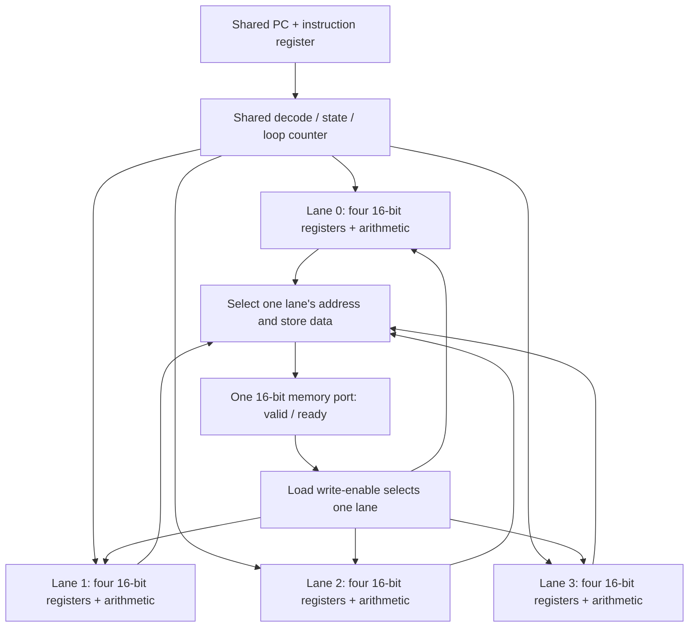

# One instruction, four data paths

Read the [SIMD4 contract](simd4.md) with [simd4.v](../rtl/simd4/simd4.v) and the [vector kernel](../programs/simd4/vector_add.py). This milestone changes how much data one instruction handles, while keeping a single instruction stream.

## 1. Duplicate the datapath, share the controller

SAP8 had one accumulator and one instruction stream. SIMD4 has four register banks and arithmetic paths, all controlled by one PC, instruction register, decoder, and loop counter.



All four lanes execute `ADD r3, r1, r2` on the same edge, each using its own operands. A `LANE r0` instruction gives lanes different starting indices: 0, 1, 2, and 3. Those values become addresses for distinct elements, while the shared decoder still issues one instruction.

The Verilog `generate for` creates repeated hardware during elaboration. It does not make a runtime loop that computes lane 0, then lane 1. In contrast, `memory_lane` is an actual register that advances across clock edges to serialize memory transfers.

**Predict:** after `LANE r0` followed by `ADDI r0,r0,4`, the four r0 values are 4, 5, 6, and 7. They change together.

## 2. What each construct builds

| RTL construct | Circuit interpretation |
| --- | --- |
| `reg [15:0] r [0:3]` inside each generated lane | Four 16-bit state registers per lane: 256 lane-state bits in the four-lane design |
| `r[ra]`, `r[rb]` | Muxes select source registers from a bank |
| `r[rd] <= ...` in a clocked process | Destination decoding enables the selected register at the edge |
| `r[ra] + r[rb]` / `r[ra] + immediate` | Per-lane addition and selection logic; the low 16 bits are captured |
| `wire ... = ...` | A continuous connection/expression, not a one-time variable initialization |
| `address_base[memory_lane]` | A mux selects one lane's address for the shared port |
| `memory_lane == lane` on LOAD | One lane's destination captures the accepted read value |
| `state` / `loop_count` | Shared control storage; no per-lane PC or branch decision |
| `register_state` / named r0–r3 aliases | Wiring for observation; no additional storage |

Register aliases are allowed. For `ADD r0,r0,r1`, nonblocking assignment means each lane samples the old r0 and r1 before r0 updates. For a load into its address register, the accepting edge uses the old address; subsequent instructions see the loaded value.

The decoder ignores fields that an operation does not use. Synthesis may simplify, share, or reorganize expressions, so source operators are not a literal gate count. This is still clocked storage connected by combinational paths, just as in SAP8.

## 3. Use a shared loop to cover a vector

The kernel's r0 contains the element index. Each iteration loads A[r0] and B[r0], computes their sum, stores C[r0], and increments r0 by the number of lanes. The scalar loop counter counts groups.

For eight elements on four lanes:

| Group | Lane 0 | Lane 1 | Lane 2 | Lane 3 |
| --- | ---: | ---: | ---: | ---: |
| First | 0 | 1 | 2 | 3 |
| Second | 4 | 5 | 6 | 7 |

Both LOOP decisions apply to all lanes. There is no instruction for “only lane 2 branches.” Length must be divisible by lane count because all lanes remain active. A future tail mask would need explicit semantics and tests.

Addition wraps at 16 bits: `ffff + 0001 = 0000`, and `8000 + 8000 = 0000`. No carry or signed-overflow flag is stored. These are integer bit patterns; interpreting `8000` as −32768 changes its meaning, not the low-bit addition circuit.

## 4. Follow a stalled request

LOAD/STORE first enter MEMORY with `memory_lane=0`. The selected lane drives address and data; `mem_valid=1` means they describe a request.

At a rising edge:

- If ready is low, no transfer occurs. Lane, address, direction, data, and architectural state hold; the stall/cycle counters advance.
- If valid and ready are high, one word transfers. LOAD writes only that lane's register; STORE updates external memory. The lane selector advances.
- After the last lane, the instruction retires and the core returns to FETCH.

The responder controls `mem_ready`. It may hold it low for many clocks. The engine must not skip lanes, change a pending address, duplicate a store, or count a retirement during those waits. The scoreboard checks these properties as well as the final answer.

Memory effects are visible per accepted transfer. If reset occurs after lane 0's store but before lane 1's, lane 0's write remains. Reset suppresses the pending request and clears internal state at the reset edge. It does not undo external effects. The cancellation tests check both partial loads and partial stores, then reload the test inputs and launch again.

## 5. Read the two waveforms

Run `make waves-simd4`. Open `build/simd4/icarus/vector-wave.vcd` and `stalled-wave.vcd` in Surfer. Verilator emits equivalent files under `build/simd4/verilator/`. Both examples add eight elements with four lanes; only memory readiness changes.

Add `clk`, `reset`, `start`, `busy`, `done`, `state`, `pc`, `instruction`, `loop_count`, `memory_lane`, `mem_valid`, `mem_ready`, `mem_write`, `mem_address`, `mem_write_data`, `mem_read_data`, `retired`, `cycles`, and `stalls` from `simd4_tb.dut`. Expand each `lanes[0]` through `lanes[3]` scope and add its named r0–r3 wires. Use hex for operands and decimal for state/lane/counters.

The initial reset is sampled at 15 ns, and launch at 35 ns. The testbench also pulses start while busy to verify it is ignored. The clock period is 10 ns; the performance counters count edges, not nanoseconds.

| No-wait trace | Observation |
| --- | --- |
| 55 ns | LANE commits r0 = 0, 1, 2, 3 |
| 75 ns | Shared loop counter becomes 2 |
| 105, 115, 125, 135 ns | First LOAD accepts one A element per edge, in lane order |
| 165, 175, 185, 195 ns | Second LOAD fills r2 from B |
| 215 ns | All four r3 registers capture sums together: `0000`, `8000`, `0000`, `ffff` |
| 245, 255, 265, 275 ns | STORE writes these results to `80`, `81`, `82`, `83` |
| 295 ns | Every lane's r0 advances by four |
| 315 ns | LOOP decrements the shared counter to 1 and branches to PC 2 |

Transfer lines in the `.log` files use the actual accepting edge. Retirement lines sample 1 ns afterward, so the ADD line says **216 ns**. The packed `regs` trace places lane 0/r0 in its least significant 16 bits; named waveform aliases are easier to read.

The stalled trace repeats 0, 1, 2, 3 extra waits across successive transfers. The first LOAD accepts at 105, 125, 155, and 195 ns. At 115 ns, lane 1 is waiting: inspect the stable address and register state, and watch `stalls` increment. ADD consequently commits at 335 ns. Both runs produce identical results: the no-wait run uses 54 cycles and 0 stalls; the varying-wait run uses 90 cycles and 36 stalls. Each transfers 24 words and retires 15 instructions.

The generated Icarus and Verilator waveforms agree on 41 inspected signals, including all 16 lane registers: 116 common snapshots after launch for the no-wait run and 188 for the stalled run. All four first-group ADD results were also checked at their capture edge.

## 6. Explain the speedup with measured cycles

`make bench-simd4` holds the vector length at **32 elements** and sweeps lane count plus ready delay. Results are saved in `build/simd4/icarus/benchmark.json`; the Verilator suite generates a matching report. Every run performs 64 reads and 32 writes, or **96 transfers**.

| Extra wait edges per transfer | 1 lane | 2 lanes | 4 lanes | 1-lane / 4-lane speedup |
| --- | ---: | ---: | ---: | ---: |
| 0 | 486 cycles | 294 cycles | 198 cycles | 2.45× |
| 1 | 582 cycles | 390 cycles | 294 cycles | 1.98× |
| 3 | 774 cycles | 582 cycles | 486 cycles | 1.59× |

The `wait` field in reports is a **mode**: 0 means no waits, 1 means one extra wait, 2 means three extra waits, and 3 is the repeating 0/1/2/3 pattern. The port remains one word wide; ready delays reduce its available transfer rate. This experiment varies offered memory bandwidth, not the number of physical memory ports.

For N elements and L lanes, the kernel retires `3 + 6N/L` instructions and performs `3N` transfers. The three instructions outside the loop are LANE, SETLOOP, and HLT. Each instruction pays one FETCH and one EXECUTE edge; memory instructions additionally pay for their accepted transfers and waits:

```text
cycles = 2 × (3 + 6N/L) + 3N + stalls
```

For four lanes and 32 elements, that is `2 × 51 + 96 = 198`. Four lanes reduce the number of instructions, while the one-word memory port still handles all 96 transfers. This is why adding compute lanes alone does not produce a fourfold speedup. These are simulated cycle ratios for the same kernel; they do not include changes in physical maximum frequency or area.

## 7. Synthesis and exercises

The verified Yosys 0.69+post four-lane netlist has **3,051 generic primitive cells**, including **501 mapped flip-flop cells** and **610 mux cells**, with **no latches**. The remainder is combinational logic. These counts include debug/retirement state and four 32-bit performance counters. Optimization can merge or simplify source-level storage; a source register declaration is not a final physical cell count. Program/data memories are outside the synthesized core.

The extra area comes from lane register banks, arithmetic, register selection, shared-port selection, and control/measurement logic. There are no caches, warp scheduler, multiply units, graphics functions, or FPGA timing results in this milestone.

1. Predict cycles for 16 elements on two lanes with one wait per transfer. Generate the kernel with `program(lanes=2, length=16)` and compare your calculation with the runner.
2. In the waveform, find ADD's single capture edge and STORE's four accepting edges. Explain why the registers update together but the memory words do not.
3. Change one input pair to `ffff` and `0002`. Predict the 16-bit result, then check the direct Python calculation and RTL agree.
4. Sketch what a four-word memory port would need to accept all four lane addresses together. Consider what happens if two lanes target the same address before proposing a speedup.
5. Specify the result width and truncation rule for a future multiply operation before adding it. A small matrix kernel is the next compute extension.
