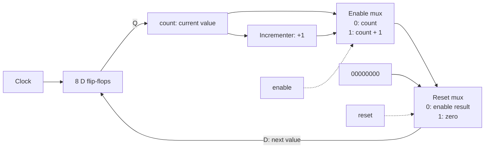

# How Verilog becomes gates

Synthesis turns a description of hardware behavior into components and connections that implement it. The result is a **netlist**: a list of cells and the wires connecting them.

On a breadboard, you choose gates and connect wires yourself. With Verilog, you describe the circuit, and synthesis derives an implementation. It does not execute the RTL line by line on a hidden CPU.

## Our counter as an example

From [counter.v](../labs/01-counter/counter.v):

```verilog
always @(posedge clk) begin
    if (reset)
        count <= 8'd0;
    else if (enable)
        count <= count + 8'd1;
end
```

| Code | Hardware inferred |
| --- | --- |
| Eight-bit `count`, assigned in a clocked process | Eight bits of storage: eight flip-flops |
| `@(posedge clk)` | Flip-flops update on rising clock edges |
| `count + 8'd1` | Combinational incrementer logic |
| `if (enable)` | Selection between incrementing and keeping the old value |
| `if (reset)` before the enable condition | Reset has priority and selects zero |
| No assignment when both controls are low | Keep the stored value |

The keyword `reg` alone does not imply a physical register. Here, assignment in a rising-edge process causes flip-flops to be inferred.

## Choices become multiplexers

The complete next-state equation is:

```text
next_count = reset ? 0 : (enable ? count + 1 : count)
```

A multiplexer selects between inputs. For one bit, it can be built from gates:

```text
out = (NOT select AND a) OR (select AND b)
```

When `select = 0`, the output is `a`; when it is 1, the output is `b`. An eight-bit mux makes that choice across eight bits.

Our counter can be implemented with an enable mux followed by a reset mux:



Data connections carry eight bits; clock and control connections carry one bit. Feedback from `count` allows holding the old value. The flip-flops break this feedback path into successive clock cycles.

This is an equivalent circuit, not a promise of separate physical mux cells. Synthesis can simplify it or use flip-flops with built-in control features.

## Addition becomes gates too

Let `q` be the stored count and `inc` the incrementer output before reset/enable selection:

```text
inc[0] = NOT q[0]
inc[1] = q[1] XOR q[0]
inc[2] = q[2] XOR (q[1] AND q[0])
inc[3] = q[3] XOR (q[2] AND q[1] AND q[0])
...
inc[7] = q[7] XOR (q[6] AND ... AND q[0])
```

Bit zero always toggles. Each higher bit toggles if every lower bit is one: that is the carry condition.

```text
00000111   7
       +   1
--------
00001000   8
```

Only eight result bits are stored, so `11111111 + 1` wraps to `00000000`. No ninth flip-flop stores the carry. Synthesis may share carry terms or use different equivalent gates to reduce area or delay.

## What the clock does

Combinational gates continuously respond to their inputs, subject to physical propagation delay. They do not wait for a clock. The flip-flops capture the selected result at a rising edge. Their outputs then feed the incrementer again, preparing the next result. The clock period must allow the logic to settle before capture.

`<=` is a nonblocking assignment in simulation: it schedules a state update using the values evaluated at that edge. It is not itself a gate or a physical delay component.

For example, with `count = 7`, `enable = 0`, and `reset = 1`, the selected next value is zero. Count remains seven until the rising edge, then becomes zero. This is a **synchronous reset**.

## Our actual synthesis output

Run `make synth` from the repository root. It produces `build/counter-synth.log` and the machine-readable netlist `build/counter.json`.

The inspected Yosys 0.69+post output contained:

| Generic cell | Count |
| --- | ---: |
| Flip-flop with synchronous reset and enable (`$_SDFFE_PP0P_`) | 8 |
| XOR | 6 |
| XNOR | 1 |
| AND | 5 |
| NAND | 1 |
| NOT | 1 |

Reset and enable are represented within the flip-flop cells, so separate mux cells do not appear in this listing. The incrementer was optimized into an equivalent gate network.

These 22 generic cells are not a transistor count or a final FPGA resource count. Different synthesis versions, constraints, and target technologies can produce different equivalent implementations.

## From source text to a physical implementation

Conceptually, the synthesis tool:

1. **Parses and elaborates** modules, widths, constants, parameters, and connections.
2. **Infers hardware** such as storage, arithmetic, and selections.
3. **Optimizes** Boolean expressions, constants, and unused logic.
4. **Maps** the circuit to generic cells or resources in a selected target.
5. **Writes a netlist** containing the components and connections.

These operations may be repeated or interleaved. Our `make synth` performs generic synthesis; targeting a particular FPGA or ASIC requires additional steps.

An **FPGA** already contains configurable lookup tables (LUTs), flip-flops, routing, and other resources. A LUT implements a Boolean function by storing its truth table. Arithmetic can also use dedicated carry circuitry. Implementation tools map the design onto those resources, and a bitstream configures the existing hardware.

An **ASIC** flow maps logic onto a target cell library containing physical gate and flip-flop designs. Placement and routing determine their locations and connections; manufacturing realizes the design in silicon.

Simulation is a separate path: Icarus or Verilator models behavior so we can test it. The testbench's `#5` delay and `$display` messages are simulation instructions, not gates in our synthesized counter.
